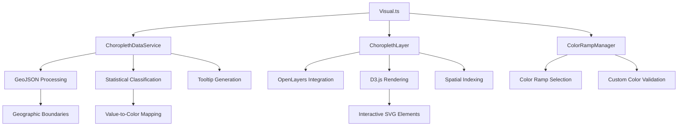

# Choropleth Visualization Specification

## Overview

The choropleth visualization component of the Maplumi Power BI visual provides sophisticated area-based data mapping capabilities. It renders geographic boundaries (polygons) colored according to data values, with support for statistical classification, dynamic color schemes, and interactive features.

Note on GeoBoundaries levels
- This visual supports GeoBoundaries administrative levels up to ADM3. If a selected country/level doesn’t have available data (per GeoBoundaries), the visual will display a warning and skip rendering that layer. Use ADM1–ADM3 or switch release type. ADM0 boundaries are provided via Maplumi or OpenDataSoft sources.

## Table of Contents

1. [Architecture Overview](#architecture-overview)
2. [Data Processing Pipeline](#data-processing-pipeline)
3. [Classification Algorithms](#classification-algorithms)
4. [Color Management](#color-management)
5. [Rendering Engine](#rendering-engine)
6. [Configuration System](#configuration-system)
7. [Performance Optimization](#performance-optimization)
8. [Integration Points](#integration-points)

---

## Architecture Overview

### Component Structure



### Core Classes

#### ChoroplethLayer (Layer Implementation)
```typescript
class ChoroplethLayer extends Layer {
    // OpenLayers layer for choropleth rendering
    private svg: d3.Selection<SVGSVGElement, unknown, HTMLElement, any>;
    private geojson: FeatureCollection;
    private options: ChoroplethLayerOptions;
    private valueLookup: { [key: string]: number };
    private spatialIndex: RBush<any>;
    private selectedIds: ISelectionId[];
}
```

#### ChoroplethDataService (Data Processing)
```typescript
class ChoroplethDataService {
    // Handles data transformation and statistical operations
    public processGeoData(data: any, pcodeKey: string, validPCodes: string[]): FeatureCollection;
    public extractTooltips(categorical: any): VisualTooltipDataItem[][];
    public classifyData(values: number[], method: string, classes: number): any[];
    public createColorScale(values: any[], colorRamp: string[], method: string): Function;
}
```

---

## Data Processing Pipeline

### 1. Geographic Data Processing

#### Input Data Formats
- **GeoBoundaries API**: Direct API integration with metadata and boundary data
- **GeoJSON**: Direct support for FeatureCollection format
- **TopoJSON**: Automatic conversion to GeoJSON with topology preservation
- **Feature Filtering**: Boundary features filtered by valid administrative codes

Note on TopoJSON with multiple objects
- When a TopoJSON file contains multiple entries under `objects`, the visual will:
    1) Use the object name provided in the Format pane (Boundary → TopoJSON Object Name), if specified.
    2) Otherwise auto-select the object with the most polygonal geometries (Polygon/MultiPolygon).
    3) If no polygonal object is found, it falls back to the first object.

GeoJSON validation
- After conversion, the visual requires a valid GeoJSON FeatureCollection with a `features` array. If validation fails, a user-facing warning is shown suggesting to verify the URL, object name, and file format.

#### Data Flow
```typescript
// Geographic data processing workflow
Boundary Data Source Selection (GeoBoundaries vs Custom)
    ↓
GeoBoundaries: API Metadata Fetch → Boundary Data Download
Custom: Direct GeoJSON/TopoJSON URL Fetch
    ↓
Format Detection & Conversion (TopoJSON → GeoJSON)
    ↓
Feature Filtering (by administrative codes)
    ↓
Geometry Simplification (zoom-level dependent, topology-preserving)
    ↓
Spatial Index Creation (RBush)
    ↓
Rendering-Ready FeatureCollection
```

#### Processing Implementation
```typescript
public async processGeoData(options: ChoroplethOptions, validPCodes: string[]): Promise<FeatureCollection> {
    let geojson: FeatureCollection;
    
    // Determine data source and fetch boundary data
    if (options.boundaryDataSource === 'geoboundaries') {
        // Use GeoBoundaries API
        const metadata = await GeoBoundariesService.fetchMetadata(options);
        if (!metadata) {
            throw new Error('Failed to fetch GeoBoundaries metadata');
        }
        
        const boundaryDataUrl = GeoBoundariesService.getDownloadUrl(metadata);
        const response = await fetch(boundaryDataUrl);
        const data = await response.json();
        
        geojson = this.isTopoJSON(data) 
            ? this.convertTopoJSONToGeoJSON(data)
            : data as FeatureCollection;
    } else {
        // Use custom URL
        const response = await fetch(options.topoJSON_geoJSON_FileUrl);
        const data = await response.json();
        
        geojson = this.isTopoJSON(data)
            ? this.convertTopoJSONToGeoJSON(data)
            : data as FeatureCollection;
    }

    // Get the appropriate field key for filtering
    const pcodeKey = options.boundaryDataSource === 'geoboundaries' 
        ? GeoBoundariesService.getBoundaryFieldName(options)
        : options.locationPcodeNameId;

    // Filter features based on valid administrative codes
    return {
        ...geojson,
        features: geojson.features.filter(feature =>
            validPCodes.includes(feature.properties[pcodeKey])
        )
    };
}
```

### 2. Geometry Simplification (TopoJSON)

We build a TopoJSON topology from the input GeoJSON once, compute triangle-area weights via `presimplify`, and then apply `simplify` with thresholds derived from quantiles. This preserves shared borders and avoids gaps/overlaps at coarse LODs.

LOD thresholds are selected per zoom resolution and modulated by a user setting "Simplification Strength" (0–100). Higher strength increases simplification aggressiveness.

```typescript
// In ChoroplethLayer constructor
this.topo = topology({ layer: this.geojson });
this.topoPresimplified = presimplify(this.topo);
this.recomputeThresholds(); // uses simplificationStrength to lerp quantiles

// At render time per LOD
const threshold = this.getThresholdForLevel(level);
const simplifiedTopo = simplify(this.topoPresimplified, threshold);
const simplifiedGeo = feature(simplifiedTopo, simplifiedTopo.objects.layer);
```

### 3. Statistical Data Processing

#### Value Extraction
- Administrative codes (P-codes) from categorical data
- Numeric measure values for choropleth coloring
- Tooltip data from additional fields

#### Data Validation
```typescript
// Data validation and sanitization
const validValues = measureValues.filter(v => 
    !isNaN(v) && isFinite(v) && v !== null && v !== undefined
);

// Create lookup table for efficient access
const valueLookup: { [key: string]: number } = {};
pCodes.forEach((pCode, index) => {
    valueLookup[pCode] = measureValues[index];
});
```

---

## Classification Algorithms

### 1. Equal Interval Classification

#### Algorithm
Divides the data range into equal-sized intervals.

```typescript
public classifyEqualInterval(values: number[], classes: number): number[] {
    const min = Math.min(...values);
    const max = Math.max(...values);
    const interval = (max - min) / classes;
    
    const breaks = [];
    for (let i = 0; i <= classes; i++) {
        breaks.push(min + (i * interval));
    }
    return breaks;
}
```

#### Use Cases
- **Uniform Distribution**: When data values are relatively evenly distributed
- **Comparison**: Facilitating comparison across multiple maps with same classification
- **Simplicity**: Easy to understand and explain

### 2. Quantile Classification

#### Algorithm
Divides data into classes with equal numbers of observations.

```typescript
public classifyQuantile(values: number[], classes: number): number[] {
    const sortedValues = [...values].sort((a, b) => a - b);
    const breaks = [];
    
    for (let i = 0; i <= classes; i++) {
        const position = (i / classes) * (sortedValues.length - 1);
        const index = Math.round(position);
        breaks.push(sortedValues[Math.min(index, sortedValues.length - 1)]);
    }
    
    return [...new Set(breaks)].sort((a, b) => a - b);
}
```

#### Use Cases
- **Skewed Data**: Effective for data with outliers or uneven distribution
- **Relative Ranking**: Emphasizes relative position within the dataset
- **Balanced Visualization**: Ensures each class has similar representation

### 3. Natural Breaks (Jenks)

#### Algorithm
Uses Jenks natural breaks optimization to minimize within-class variance.

```typescript
public classifyNaturalBreaks(values: number[], classes: number): number[] {
    // Jenks natural breaks implementation using simple-statistics
    return ss.jenks(values, classes);
}
```

#### Use Cases
- **Natural Clusters**: Reveals natural groupings in the data
- **Optimal Classification**: Mathematically optimized class boundaries
- **Data-Driven**: Adapts to the specific characteristics of the dataset

### 4. Classification Comparison

| Method | Advantages | Disadvantages | Best For |
|--------|------------|---------------|----------|
| Equal Interval | Simple, comparable across datasets | May not reflect data distribution | Uniform data, cross-map comparison |
| Quantile | Balanced representation | May group dissimilar values | Skewed data, relative ranking |
| Natural Breaks | Optimized boundaries | Complex to explain | Natural data clusters |

---

## Color Management

### Built-in Color Ramps

#### ColorBrewer-Inspired Palettes
```typescript
const COLOR_RAMPS = {
    // Sequential schemes
    BLUES: ["#f7fbff", "#deebf7", "#c6dbef", "#9ecae1", "#6baed6", "#4292c6", "#2171b5", "#08519c", "#08306b"],
    REDS: ["#fff5f0", "#fee0d2", "#fcbba1", "#fc9272", "#fb6a4a", "#ef3b2c", "#cb181d", "#a50f15", "#67000d"],
    GREENS: ["#f7fcf5", "#e5f5e0", "#c7e9c0", "#a1d99b", "#74c476", "#41ab5d", "#238b45", "#006d2c", "#00441b"],
    
    // Diverging schemes
    RDBU: ["#67001f", "#b2182b", "#d6604d", "#f4a582", "#fddbc7", "#f7f7f7", "#d1e5f0", "#92c5de", "#4393c3", "#2166ac", "#053061"],
    RDYLBU: ["#a50026", "#d73027", "#f46d43", "#fdae61", "#fee090", "#ffffbf", "#e0f3f8", "#abd9e9", "#74add1", "#4575b4", "#313695"],
    
    // Categorical schemes
    SET1: ["#e41a1c", "#377eb8", "#4daf4a", "#984ea3", "#ff7f00", "#ffff33", "#a65628", "#f781bf", "#999999"],
    DARK2: ["#1b9e77", "#d95f02", "#7570b3", "#e7298a", "#66a61e", "#e6ab02", "#a6761d", "#666666"]
};
```

#### Custom Color Ramp Support
```typescript
// Custom color ramp validation
const validCustomColorRamp = customColorRamp
    .map(c => c.trim())
    .filter(c => /^#([0-9A-Fa-f]{3}){1,2}$/.test(c));

// Use custom ramp if valid, otherwise fallback
const finalColorRamp = validCustomColorRamp.length >= 2 
    ? validCustomColorRamp 
    : colorRamp;
```

### Color Scale Creation

#### Continuous Color Mapping
```typescript
public createColorScale(values: any[], colorRamp: string[], method: string): Function {
    if (method === 'unique-values') {
        // Categorical color mapping for unique values
        const uniqueValues = [...new Set(values)];
        return (value: any) => {
            const index = uniqueValues.indexOf(value);
            return index >= 0 ? colorRamp[index % colorRamp.length] : '#cccccc';
        };
    } else {
        // Continuous color mapping with classification
        const numericValues = values.filter(v => typeof v === 'number');
        const breaks = this.classifyData(numericValues, method, colorRamp.length - 1);
        
        return (value: number) => {
            if (value === null || value === undefined || isNaN(value)) {
                return 'transparent';
            }
            
            for (let i = 0; i < breaks.length - 1; i++) {
                if (value >= breaks[i] && value < breaks[i + 1]) {
                    return colorRamp[i];
                }
            }
            return colorRamp[colorRamp.length - 1];
        };
    }
}
```

---

## Rendering Engine

### D3.js Integration with OpenLayers

#### Projection Synchronization
```typescript
// Align D3 projection with OpenLayers view
const scale = 6378137 / resolution;
const d3Projection = geoMercator()
    .scale(scale)
    .center(center)
    .translate([width / 2, height / 2]);

this.d3Path = geoPath().projection(d3Projection);
```

#### SVG Path Generation
```typescript
// Render geographic features as SVG paths
simplifiedFeatures.features.forEach((feature: GeoJSONFeature) => {
    const pCode = feature.properties[this.options.dataKey];
    const valueRaw = this.valueLookup[pCode];
    const fillColor = this.options.colorScale(valueRaw);
    
    const path = choroplethGroup.append('path')
        .datum(feature)
        .attr('d', this.d3Path)
        .attr('stroke', this.options.strokeColor)
        .attr('stroke-width', this.options.strokeWidth)
        .attr('fill', fillColor)
        .attr('fill-opacity', this.options.fillOpacity);
});
```

### Interactive Features

#### Selection Management
```typescript
// Visual selection handling
path.on('click', (event: MouseEvent) => {
    if (!dataPoint?.selectionId) return;
    
    const nativeEvent = event;
    this.options.selectionManager.select(
        dataPoint.selectionId, 
        nativeEvent.ctrlKey || nativeEvent.metaKey
    ).then((selectedIds: ISelectionId[]) => {
        this.selectedIds = selectedIds;
        this.changed(); // Trigger re-render
    });
});
```

#### Tooltip Integration
```typescript
// Power BI tooltip integration
if (dataPoint?.tooltip) {
    this.options.tooltipServiceWrapper.addTooltip(
        path,
        () => dataPoint.tooltip,
        () => dataPoint.selectionId,
        true
    );
}
```

### Layer Ordering
```typescript
// Ensure proper layer stacking (choropleth behind circles)
const choroplethGroupNode = choroplethGroup.node();
const circles1GroupNode = this.svg.select('#circles-group-1').node();
const circles2GroupNode = this.svg.select('#circles-group-2').node();

if (choroplethGroupNode && circles1GroupNode && circles2GroupNode) {
    choroplethGroupNode.parentNode.appendChild(circles1GroupNode);
    choroplethGroupNode.parentNode.appendChild(circles2GroupNode);
}
```

---

## Configuration System

### Setting Groups Structure

#### 1. Location Boundary Settings
```typescript
class choroplethLocationBoundarySettingsGroup extends formattingSettings.SimpleCard {
    boundaryDataSource: ItemDropdown;        // GeoBoundaries or Custom source
    
    // GeoBoundaries-specific settings
    geoBoundariesCountry: ItemDropdown;      // Country/Region selection (91+ countries)
    geoBoundariesReleaseType: ItemDropdown;  // gbOpen, gbHumanitarian, gbAuthoritative
    geoBoundariesAdminLevel: ItemDropdown;   // ADM0-ADM3 administrative levels
    
    // Boundary field mapping (dynamic based on source)
    boundaryIdField: ItemDropdown;           // Field mapping for GeoBoundaries
    customBoundaryIdField: TextInput;        // Custom field name for custom sources
    
    // Custom boundary data
    topoJSON_geoJSON_FileUrl: TextInput;     // Custom TopoJSON/GeoJSON URL
}
```

#### 2. Classification Settings
```typescript
class choroplethClassificationSettingsGroup extends formattingSettings.SimpleCard {
    classificationMethod: ItemDropdown;  // Equal Interval, Quantile, Natural Breaks, Unique Values
    numberOfClasses: NumUpDown;          // Number of classification classes (2-9)
}
```

#### 3. Display Settings
```typescript
class choroplethDisplaySettingsGroup extends formattingSettings.SimpleCard {
    colorRamp: ItemDropdown;            // Predefined color schemes
    customColorRamp: TextInput;         // Custom color sequence
    reverseColorRamp: ToggleSwitch;     // Reverse color order
    strokeColor: ColorPicker;           // Boundary line color
    strokeWidth: NumUpDown;             // Boundary line width
    fillOpacity: NumUpDown;             // Area fill transparency
}
```

#### 4. Legend Settings
```typescript
class choroplethLegendSettingsGroup extends formattingSettings.SimpleCard {
    showLegend: ToggleSwitch;           // Display legend
    legendTitle: TextInput;             // Legend title text
    legendTitleColor: ColorPicker;      // Title color
    legendPosition: ItemDropdown;       // Legend placement
    legendOrientation: ItemDropdown;    // Horizontal/vertical
    labelFormat: ItemDropdown;          // Number formatting
}
```

### Options Transformation

#### Converting Settings to Options
```typescript
private getChoroplethOptions(): ChoroplethOptions {
    const settings = this.visualFormattingSettingsModel.ChoroplethVisualCardSettings;
    
    return {
        layerControl: settings.choroplethLocationBoundarySettingsGroup.layerControl?.value || true,
        
        // Boundary data source configuration
        boundaryDataSource: settings.choroplethLocationBoundarySettingsGroup.boundaryDataSource.value.value,
        
        // GeoBoundaries-specific options
        geoBoundariesCountry: settings.choroplethLocationBoundarySettingsGroup.geoBoundariesCountry.value.value,
        geoBoundariesReleaseType: settings.choroplethLocationBoundarySettingsGroup.geoBoundariesReleaseType.value.value,
        geoBoundariesAdminLevel: settings.choroplethLocationBoundarySettingsGroup.geoBoundariesAdminLevel.value.value,
        
        // Dynamic boundary field mapping
        sourceFieldID: settings.choroplethLocationBoundarySettingsGroup.boundaryIdField.value.value,
        locationPcodeNameId: settings.choroplethLocationBoundarySettingsGroup.customBoundaryIdField.value,
        
        // Custom boundary data URL
        topoJSON_geoJSON_FileUrl: settings.choroplethLocationBoundarySettingsGroup.topoJSON_geoJSON_FileUrl.value,
        
        // Classification and display settings
        classificationMethod: settings.choroplethClassificationSettingsGroup.classificationMethod.value.value,
        classes: settings.choroplethClassificationSettingsGroup.numberOfClasses.value,
        colorRamp: settings.choroplethDisplaySettingsGroup.colorRamp.value.value,
        customColorRamp: settings.choroplethDisplaySettingsGroup.customColorRamp.value,
        strokeColor: settings.choroplethDisplaySettingsGroup.strokeColor.value.value,
        strokeWidth: settings.choroplethDisplaySettingsGroup.strokeWidth.value,
        layerOpacity: settings.choroplethDisplaySettingsGroup.fillOpacity.value / 100,
        // ... additional options mapping
    };
}
```

---

## GeoBoundaries Integration

### Overview

The Maplumi Power BI visual now includes built-in integration with the [GeoBoundaries](https://www.geoboundaries.org/) API, providing access to high-quality administrative boundary data for 91+ countries without requiring external data preparation.

### GeoBoundaries Service Architecture

#### GeoBoundariesService Class
```typescript
export class GeoBoundariesService {
    public static buildApiUrl(options: ChoroplethOptions): string;
    public static fetchMetadata(options: ChoroplethOptions): Promise<GeoBoundariesMetadata | null>;
    public static getBoundaryFieldName(options: ChoroplethOptions): string;
    public static validateOptions(options: ChoroplethOptions): { isValid: boolean; message?: string };
    public static isAllCountriesRequest(options: ChoroplethOptions): boolean;
    public static getAllCountriesUrl(): string;
}
```

### Data Source Configuration

#### 1. Boundary Data Sources
- **GeoBoundaries**: Integrated API access to standardized boundary data
- **Custom**: User-provided TopoJSON/GeoJSON URLs

#### 2. GeoBoundaries Release Types
```typescript
const RELEASE_TYPES = {
    gbOpen: "gbOpen (CC-BY 4.0)",           // Open license, fastest updates
    gbHumanitarian: "gbHumanitarian (UN OCHA)", // Humanitarian use optimized
    gbAuthoritative: "gbAuthoritative (UN SALB)" // Official government boundaries
};
```

#### 3. Administrative Levels
```typescript
const ADMIN_LEVELS = {
    ADM0: "ADM0 (Country Borders)",      // National boundaries
    ADM1: "ADM1 (States/Provinces)",     // First-level subdivisions
    ADM2: "ADM2 (Counties/Districts)",   // Second-level subdivisions
    ADM3: "ADM3 (Municipalities)"       // Third-level subdivisions
};
```

### Field Mapping System

#### Dynamic Field Options
The boundary ID field options change dynamically based on the selected data source:

**GeoBoundaries Fields:**
- `shapeISO`: ISO codes (e.g., "KE-01", "US-CA")
- `shapeName`: Human-readable names (e.g., "Nairobi", "California")
- `shapeID`: Unique identifiers within the dataset
- `shapeGroup`: Parent administrative unit (typically country)

**Custom Source Fields:**
- `customBoundaryIdField`: User-defined field name for custom data sources

#### Conditional Field Visibility
```typescript
public applyConditionalDisplayRules(): void {
    const selectedSource = this.boundaryDataSource.value?.value;
    const isGeoBoundaries = selectedSource === "geoboundaries";
    const isAllCountries = isGeoBoundaries && this.geoBoundariesCountry.value?.value === "ALL";
    
    // Show/hide GeoBoundaries-specific fields
    this.geoBoundariesCountry.visible = isGeoBoundaries;
    this.geoBoundariesAdminLevel.visible = isGeoBoundaries;
    this.geoBoundariesReleaseType.visible = isGeoBoundaries && !isAllCountries;
    
    // Handle "All Countries" restrictions
    if (isAllCountries) {
        this.geoBoundariesAdminLevel.items = [
            { value: "ADM0", displayName: "ADM0 (Country Borders)" }
        ];
    }
}
```

### API Integration

#### URL Construction
```typescript
public static buildApiUrl(options: ChoroplethOptions): string {
    const { geoBoundariesReleaseType, geoBoundariesCountry, geoBoundariesAdminLevel } = options;
    
    // Special case: "All Countries" uses custom aggregated dataset
    if (geoBoundariesCountry === "ALL") {
        return VisualConfig.GEOBOUNDARIES.ALL_COUNTRIES_URL;
    }
    
    // Standard GeoBoundaries API URL
    return `${VisualConfig.GEOBOUNDARIES.BASE_URL}/${geoBoundariesReleaseType}/${geoBoundariesCountry}/${geoBoundariesAdminLevel}/`;
}
```

#### Metadata Fetching
```typescript
public static async fetchMetadata(options: ChoroplethOptions): Promise<GeoBoundariesMetadata | null> {
    try {
        if (options.geoBoundariesCountry === "ALL") {
            // Return mock metadata for "All Countries" dataset
            return {
                boundaryID: "ALL-COUNTRIES",
                boundaryName: "All Countries",
                staticDownloadLink: VisualConfig.GEOBOUNDARIES.ALL_COUNTRIES_URL,
                // ... additional metadata
            };
        }

        const apiUrl = this.buildApiUrl(options);
        const response = await fetch(apiUrl);
        
        if (!response.ok) {
            throw new Error(`HTTP ${response.status}: ${response.statusText}`);
        }

        return await response.json();
    } catch (error) {
        console.error("Error fetching geoBoundaries metadata:", error);
        return null;
    }
}
```

### Special Features

#### 1. "All Countries" Support
- Provides access to world-wide country boundaries in a single dataset
- Automatically restricts to ADM0 level only
- Uses custom aggregated data source for better performance
- Hides release type selection (not applicable to aggregated data)

#### 2. Country/Region Coverage
Currently supports 91 countries including:
- **Major Economies**: USA, China, India, Germany, Japan, Brazil, UK, France
- **Regions**: Complete coverage for Africa, Europe, Asia, Americas
- **Special Territories**: Comprehensive administrative boundary data
- **Humanitarian Focus**: Countries with active humanitarian operations

#### 3. Data Validation
```typescript
public static validateOptions(options: ChoroplethOptions): { isValid: boolean; message?: string } {
    // Validate required fields
    if (!options.geoBoundariesReleaseType) {
        return { isValid: false, message: "Release type is required" };
    }
    
    // Special validation for "All Countries"
    if (options.geoBoundariesCountry === "ALL" && options.geoBoundariesAdminLevel !== "ADM0") {
        return { 
            isValid: false, 
            message: "When 'All Countries' is selected, only ADM0 level is supported" 
        };
    }
    
    return { isValid: true };
}
```

---

## Performance Optimization

### 1. Geometry Simplification

#### Dynamic Simplification Based on Zoom Level
```typescript
private getSimplificationTolerance(resolution: number): number {
    // Higher resolution (zoomed in) = lower tolerance (more detail)
    // Lower resolution (zoomed out) = higher tolerance (less detail)
    const baselineResolution = 1000; // Baseline resolution in meters per pixel
    const baseTolerance = 0.001;     // Baseline tolerance in degrees
    
    return baseTolerance * (resolution / baselineResolution);
}

// Apply simplification during rendering
const tolerance = this.getSimplificationTolerance(resolution);
const options = { tolerance: tolerance, highQuality: false };
const simplifiedFeatures = simplify(this.geojson, options);
```

### 2. Spatial Indexing

#### RBush Spatial Index for Hit Testing
```typescript
// Build spatial index for efficient feature lookup
this.spatialIndex = new rbush();
const features = this.geojson.features.map((feature: GeoJSONFeature) => {
    const bounds = geoBounds(feature);
    return {
        minX: bounds[0][0],
        minY: bounds[0][1],
        maxX: bounds[1][0],
        maxY: bounds[1][1],
        feature: feature
    };
});
this.spatialIndex.load(features);
```

### 3. Efficient Data Structures

#### Value Lookup Optimization
```typescript
// Create hash map for O(1) value lookups
this.valueLookup = {};
const pCodes = options.categoryValues as string[];
const colorValues = options.measureValues as number[];
pCodes.forEach((pCode, index) => {
    this.valueLookup[pCode] = colorValues[index];
});
```

### 4. Rendering Optimizations

#### Conditional Re-rendering
```typescript
// Only re-render when necessary
public setSelectedIds(selectionIds: powerbi.extensibility.ISelectionId[]) {
    const hasChanged = !this.arraysEqual(this.selectedIds, selectionIds);
    if (hasChanged) {
        this.selectedIds = selectionIds;
        this.changed();
    }
}
```

---

## Integration Points

### 1. Power BI Data Integration

#### Data Role Mapping
```typescript
// Required data roles for choropleth
interface ChoroplethDataRoles {
    Location: string[];        // Administrative codes (P-codes)
    ChoroplethValue: number[]; // Values for area coloring
    Tooltips?: any[][];        // Additional tooltip fields
}
```

#### Selection Synchronization
```typescript
// Bi-directional selection management
this.selectionManager.registerOnSelectCallback(() => {
    const selectionIds = this.selectionManager.getSelectionIds();
    if (this.choroplethLayer) {
        this.choroplethLayer.setSelectedIds(selectionIds);
        this.choroplethLayer.changed();
    }
});
```

### 2. Boundary Data Sources

#### GeoBoundaries API Integration
```typescript
// GeoBoundaries service integration
private async fetchGeoBoundariesData(options: ChoroplethOptions): Promise<any> {
    try {
        // Validate options first
        const validation = GeoBoundariesService.validateOptions(options);
        if (!validation.isValid) {
            throw new Error(validation.message);
        }

        // Fetch metadata to get download URL
        const metadata = await GeoBoundariesService.fetchMetadata(options);
        if (!metadata) {
            throw new Error('Failed to fetch GeoBoundaries metadata');
        }

        // Download boundary data
        const downloadUrl = GeoBoundariesService.getDownloadUrl(metadata, true); // Prefer TopoJSON
        const response = await fetch(downloadUrl);
        
        if (!response.ok) {
            throw new Error(`HTTP ${response.status}: ${response.statusText}`);
        }
        
        return await response.json();
    } catch (error) {
        console.error('GeoBoundaries data fetch failed:', error);
        throw error;
    }
}
```

#### Custom URL Integration
```typescript
// Custom boundary data fetching
private async fetchCustomBoundaryData(url: string, signal?: AbortSignal): Promise<any> {
    try {
        const response = await fetch(url, { signal });
        if (!response.ok) {
            throw new Error(`HTTP ${response.status}: ${response.statusText}`);
        }
        return await response.json();
    } catch (error) {
        console.error('Custom boundary data fetch failed:', error);
        throw error;
    }
}
```

#### Unified Data Fetching
```typescript
// Unified boundary data fetching based on source
private async fetchBoundaryData(options: ChoroplethOptions, signal?: AbortSignal): Promise<any> {
    if (options.boundaryDataSource === 'geoboundaries') {
        return await this.fetchGeoBoundariesData(options);
    } else {
        return await this.fetchCustomBoundaryData(options.topoJSON_geoJSON_FileUrl, signal);
    }
}
```

### 3. Cache Integration

#### Intelligent Caching Strategy
```typescript
// Cache boundary data for performance with source-aware keys
const cacheKey = options.boundaryDataSource === 'geoboundaries'
    ? `geoboundaries_${options.geoBoundariesReleaseType}_${options.geoBoundariesCountry}_${options.geoBoundariesAdminLevel}`
    : `custom_${options.topoJSON_geoJSON_FileUrl}`;

let geojsonData = this.cacheService.get(cacheKey);

if (!geojsonData) {
    geojsonData = await this.fetchBoundaryData(options, signal);
    this.cacheService.set(cacheKey, geojsonData);
}
```

---

## Error Handling & Resilience

### Data Validation
```typescript
// Comprehensive validation of choropleth data
private validateChoroplethData(data: any): boolean {
    if (!data || typeof data !== 'object') return false;
    if (!data.features || !Array.isArray(data.features)) return false;
    
    return data.features.every(feature => 
        feature.geometry && 
        feature.properties && 
        typeof feature.properties === 'object'
    );
}
```

### Network Error Handling
```typescript
// Graceful handling of network failures
try {
    const boundaryData = await this.fetchChoroplethData(endpoint, locationLevel, signal);
    // Process successful response
} catch (error) {
    if (error.name === 'AbortError') {
        console.log('Choropleth data request was cancelled');
    } else {
        console.error('Failed to load choropleth data:', error.message);
        // Show user-friendly error message
        this.showErrorMessage('Unable to load map boundaries. Please check your connection.');
    }
}
```

---

## Advanced Features

### 1. Multi-level Geographic Hierarchies

#### Hierarchical Data Support
```typescript
// Support for multiple administrative levels
const ADMIN_LEVELS = {
    country: { endpoint: '/countries', key: 'ISO_A3' },
    region: { endpoint: '/regions', key: 'ADM1_PCODE' },
    district: { endpoint: '/districts', key: 'ADM2_PCODE' },
    subdistrict: { endpoint: '/subdistricts', key: 'ADM3_PCODE' }
};
```

### 2. Temporal Choropleth

#### Time-series Support (Future Enhancement)
```typescript
// Framework for temporal data visualization
interface TemporalChoroplethData {
    timeField: string;
    timeValues: Date[];
    spatialData: { [timestamp: string]: ChoroplethDataSet };
}
```

### 3. Custom Classification

#### User-defined Break Points (Future Enhancement)
```typescript
// Support for manual class break specification
interface CustomClassification {
    method: 'custom';
    breaks: number[];
    labels?: string[];
}
```

---

## Testing & Quality Assurance

### Unit Tests
- Classification algorithm accuracy
- Color scale generation
- Data validation logic
- Coordinate transformation

### Integration Tests
- OpenLayers-D3 synchronization
- Power BI selection integration
- External API interaction
- Cache behavior

### Performance Tests
- Large dataset rendering
- Geometry simplification effectiveness
- Memory usage optimization
- Network request efficiency

---

*This specification documents the current implementation of the choropleth visualization system with integrated GeoBoundaries support. Key recent updates include:*

- **GeoBoundaries API Integration**: Built-in support for 91+ countries with multiple release types
- **Dynamic Field Mapping**: Automatic field options based on selected data source  
- **"All Countries" Support**: Optimized global dataset with custom aggregated boundaries
- **Streamlined UI**: Conditional field visibility and intelligent admin level restrictions
- **Combined Boundary Fields**: Context-aware field selection for GeoBoundaries vs custom sources
- **Enhanced Validation**: Comprehensive option validation with user-friendly error messages

*The specification should be updated as new features are added or existing functionality is modified.*
