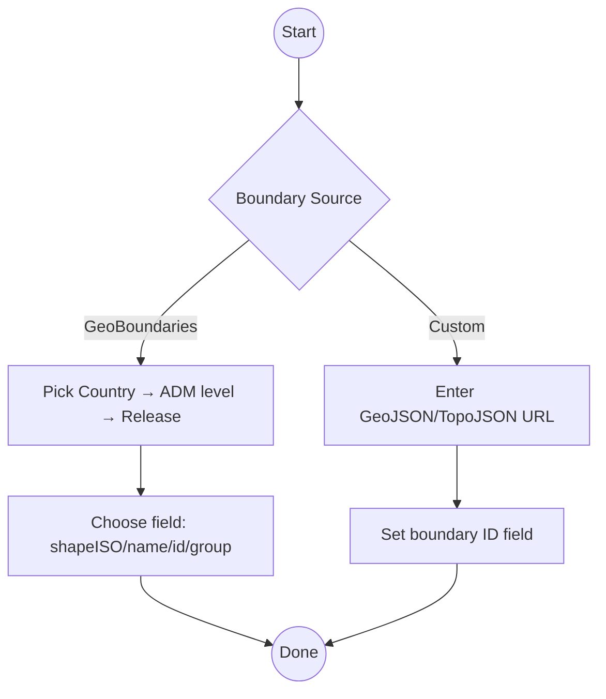

# Choropleth — Quick Reference

Short guide to get choropleth maps running fast. See the full spec for details: ./choropleth-specification.md

## What you bind

```mermaid
flowchart LR
   A[AdminPCodeNameID (Location)] --> B[Auto-toggle Choropleth]
   C[Choropleth Value (Number)] --> B
   B --> D[Areas render]
   D --> E[Legend (if enabled)]
```

Required
- Location: AdminPCodeNameID (text) matching your boundary field
- Value: Choropleth Value (number)
- Optional: Tooltips

## Configure in 3 steps
1) Boundary Source: GeoBoundaries or Custom
2) If GeoBoundaries: Country → Admin level → Release type → Field mapping
    If Custom: URL → Boundary ID field name
3) Classification: Method + Classes, then pick a Color Ramp (or Custom CSV hex)

Minimal settings
```
Boundary: GeoBoundaries, Country: KEN, Level: ADM1, Field: shapeISO
Classification: Natural Breaks, Classes: 5
Display: Color Ramp: Blues, Opacity: 70%
```

---

## Boundary sources at a glance



---

## Classify & color (essentials)

- Methods: Equal Interval, Quantile, Natural Breaks, Unique Values
- Classes: 3–7 recommended
- Colors: Built-in ramps or Custom CSV hex (#fee5d9,#fcae91,...)

---

## Quick fixes
- No areas? Check country/admin level and field mapping; for Custom, verify URL and boundary field.
- No colors? Ensure numeric choropleth value, method/classes OK, and color ramp valid.
- Selection issues? Avoid duplicate location codes; verify model relationships.

---

## Best practices (short)

1) GeoBoundaries: prefer gbOpen; ADM0–ADM1 for broader views; ADM2–ADM3 for local detail.
2) Mapping field: shapeISO for codes, shapeName for labels, shapeID if needed.
3) Classes: keep 3–7; ensure readable contrast and legend title units.
4) Performance: TopoJSON over GeoJSON; large data → higher admin level.

---

## Setup checklist

 - [ ] Source picked (GB vs Custom)
 - [ ] Country/Admin/Release set OR URL/Field set
 - [ ] Mapping field matches your codes
 - [ ] Value is numeric; classes 3–7; ramp ok

## Need more?
See the full choropleth spec for deep dives and API details → ./choropleth-specification.md

### Economic Indicators
```
Classification: Quantile (7 classes)
Color Scheme: RdYlGn
Admin Level: admin2
P-code Format: ADM2_PCODE
```

### Categories/Regions
```
Classification: Unique Values
Color Scheme: Set1
Admin Level: admin1
P-code Format: REGION_CODE
```

---

## API Endpoints

### Common Boundary Data Sources

| Provider | Base URL | Admin Levels | Format |
|----------|----------|--------------|--------|
| HDX | `https://data.humdata.org/api/boundaries` | 0-3 | GeoJSON |
| Natural Earth | `https://cdn.naturalearthdata.com` | 0-1 | GeoJSON |
| Custom | `https://your-api.com/boundaries` | Variable | GeoJSON |

### URL Structure
```
{base_url}/{admin_level}
https://api.example.com/boundaries/admin1
```

---

## Data Format Examples

### Power BI Data
```
Location  | Value | Tooltip
----------|-------|--------
AFG       | 38.9  | Afghanistan: 38.9M
USA       | 331.4 | United States: 331.4M
CHN       | 1439.3| China: 1,439.3M
```

### Boundary Data Response
```json
{
  "type": "FeatureCollection",
  "features": [
    {
      "type": "Feature",
      "properties": {
        "ISO_A3": "AFG",
        "NAME": "Afghanistan"
      },
      "geometry": { "type": "Polygon", "coordinates": [...] }
    }
  ]
}
```

---

*For detailed technical information, see the [Choropleth Specification](choropleth-specification.md) and [API Reference](api-reference.md).*
