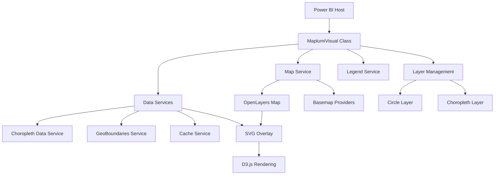

# Maplumi Power BI Visual - Main Specification

## Overview

Maplumi is a comprehensive Power BI custom visual for advanced geographic data visualization. It combines interactive mapping capabilities with sophisticated data rendering techniques, supporting both choropleth (area-based) and proportional circle visualizations with intelligent scaling and adaptive features.

## Table of Contents

1. [Visual Architecture](#visual-architecture)
2. [Core Features](#core-features)
3. [Data Model](#data-model)
4. [Visualization Types](#visualization-types)
5. [Services Architecture](#services-architecture)
6. [Configuration System](#configuration-system)
7. [Power BI Capabilities](#power-bi-capabilities)
8. [Integration Points](#integration-points)
9. [Performance Considerations](#performance-considerations)

---

## Visual Architecture

### Core Framework



### Technology Stack

- **Framework**: Power BI Visual API v5.11.0
- **Mapping Engine**: OpenLayers v10.3.1
- **Data Visualization**: D3.js v7.9.0
- **Spatial Operations**: Turf.js v7.2.0
- **Color Management**: Chroma.js v3.1.2
- **Statistics**: Simple Statistics v7.8.7
- **Spatial Indexing**: RBush v4.0.1

### Class Hierarchy

```typescript
class MaplumiVisual implements IVisual {
    // Core Power BI visual implementation
    
    // Primary Components
    private mapService: MapService;
    private legendService: LegendService;
    private circleLayer: CircleLayer;
    private choroplethLayer: ChoroplethLayer;
    
    // Data Management
    private dataService: ChoroplethDataService;
    private geoBoundariesService: GeoBoundariesService;
    private cacheService: CacheService;
    private colorRampManager: ColorRampManager;
    
    // Configuration
    private visualFormattingSettingsModel: MaplumiVisualFormattingSettingsModel;
}
```

---

## Core Features

### 1. Interactive Mapping

- **Basemap Support**: OpenStreetMap, Mapbox, MapTiler, or no basemap
- **Pan & Zoom**: Full interactive navigation with zoom controls
- **Extent Management**: Automatic fitting and manual extent locking
- **Responsive Design**: Adapts to container size changes

### 2. Dual Visualization Modes

#### Proportional Circles
- Single value circles with adaptive scaling
- Nested circles for dual-value relationships
- Donut/pie chart circles for proportional data
- Intelligent outlier handling with compressed scaling

#### Choropleth Mapping
- Area-based data visualization using GeoJSON boundaries
- **Integrated GeoBoundaries Support**: Built-in access to 91+ countries' administrative boundaries
- **Multiple Data Sources**: GeoBoundaries API or custom TopoJSON/GeoJSON URLs
- **Dynamic Field Mapping**: Automatic field options based on data source selection
- Statistical classification methods (Equal Interval, Quantile, Natural Breaks)
- Dynamic color ramp application with accessibility considerations
- Spatial indexing for performance optimization

### 3. Advanced Legend System

- **Proportional Legends**: Mathematically precise size relationships
- **Choropleth Legends**: Color-coded value ranges with customizable formatting
- **Adaptive Generation**: Automatically adjusts to outlier detection
- **Positioning Control**: Flexible legend placement and styling

### 4. GeoBoundaries Integration

- **Built-in API Access**: Direct integration with GeoBoundaries.org for standardized administrative boundaries
- **Comprehensive Coverage**: Support for 91+ countries across multiple administrative levels
- **Multiple Release Types**: Access to gbOpen, gbHumanitarian, and gbAuthoritative boundary datasets
- **Smart UI**: Conditional field visibility and validation based on user selections
- **Global Support**: Special "All Countries" dataset for worldwide visualizations
- **Field Flexibility**: Dynamic boundary field mapping (shapeISO, shapeName, shapeID, shapeGroup)

### 5. Data Processing Pipeline


---

## Data Model

### Required Data Roles

#### Geographic Coordinates
- **Longitude**: Decimal degrees (WGS84)
- **Latitude**: Decimal degrees (WGS84)

#### Value Fields
- **Size (Primary)**: Numeric values for circle scaling
- **Size (Secondary)**: Optional second numeric value for nested visualizations
- **Choropleth Value**: Numeric values for area coloring
- **Location Code**: Administrative codes for boundary matching (supports GeoBoundaries field formats)

#### Boundary Data Sources
- **GeoBoundaries**: Integrated API access to standardized administrative boundaries
  - 91+ countries with multiple administrative levels (ADM0-ADM3)
  - Three release types: gbOpen, gbHumanitarian, gbAuthoritative
  - Consistent field structure: shapeISO, shapeName, shapeID, shapeGroup
  - Special "All Countries" global dataset support
- **Custom Sources**: User-provided TopoJSON/GeoJSON URLs with configurable field mapping

#### Optional Fields
- **Tooltips**: Additional fields for hover information
- **Category**: Grouping fields for data segmentation

### Data Processing

```typescript
interface ProcessedData {
    coordinates: [number, number][];
    circleValues: {
        primary: number[];
        secondary?: number[];
    };
    choroplethValues: {
        locationCodes: string[];
        measureValues: number[];
        boundarySource: 'geoboundaries' | 'custom';
        fieldMapping: string; // shapeISO, shapeName, shapeID, shapeGroup, or custom field
    };
    tooltipData: any[][];
}
```

---

## Visualization Types

### 1. Proportional Circles

#### Single Value Circles
- **Purpose**: Display single metric spatially
- **Scaling**: Square-root scaling for perceptual accuracy
- **Features**: Adaptive outlier handling, configurable size ranges

#### Nested Circles
- **Purpose**: Compare two related metrics
- **Rendering**: Concentric circles with independent scaling
- **Use Case**: Inner/outer relationships, before/after comparisons

#### Donut Chart Circles
- **Purpose**: Show part-to-whole relationships
- **Calculation**: Angular segments based on value proportions
- **Enhancement**: Total size reflects combined magnitude

### 2. Choropleth Maps

#### Statistical Classification
- **Equal Interval**: Fixed value ranges
- **Quantile**: Equal data point distribution
- **Natural Breaks**: Jenks natural breaks optimization

#### Color Management
- **Built-in Ramps**: 15+ predefined color schemes
- **Custom Ramps**: User-defined color sequences
- **Accessibility**: ColorBrewer-inspired palettes

---

## Services Architecture

### MapService
- **Purpose**: Core OpenLayers map management
- **Responsibilities**:
  - Map initialization and configuration
  - Basemap provider integration
  - View management and extent control
  - Zoom control visibility

### LegendService
- **Purpose**: Dynamic legend generation and positioning
- **Features**:
  - Proportional circle legends with exact size matching
  - Choropleth legends with value range display
  - Flexible positioning and styling
  - Responsive text formatting

### ChoroplethDataService
- **Purpose**: Boundary data retrieval and processing
- **Capabilities**:
  - Async boundary data fetching from multiple sources
  - GeoBoundaries API integration with 91+ country support
  - Custom TopoJSON/GeoJSON URL processing
  - Data caching for performance
  - Spatial-attribute joining
  - Error handling and fallbacks

### GeoBoundariesService
- **Purpose**: GeoBoundaries API integration and management
- **Features**:
  - Dynamic API URL construction for different release types
  - Metadata fetching and validation
  - Support for gbOpen, gbHumanitarian, and gbAuthoritative releases
  - "All Countries" aggregated dataset handling
  - Field mapping for shapeISO, shapeName, shapeID, and shapeGroup
  - Administrative level validation (ADM0-ADM3)

### ColorRampManager
- **Purpose**: Color scheme management and application
- **Functions**:
  - Color ramp selection and validation
  - Custom color ramp parsing
  - Value-to-color mapping
  - Accessibility considerations

### CacheService
- **Purpose**: Intelligent caching for external resources
- **Benefits**:
  - Reduced API calls for boundary data
  - Improved performance for repeated visualizations
  - Memory-efficient storage
  - Cache invalidation strategies

---

## Configuration System

### Formatting Settings Model

The visual uses Power BI's formatting model with organized setting groups:

#### Basemap Settings
```typescript
class BasemapVisualCardSettings extends formattingSettings.SimpleCard {
    basemapSelectSettingsGroup: basemapSelectSettingsGroup;
    mapBoxSettingsGroup: mapBoxSettingsGroup;
    maptilerSettingsGroup: maptilerSettingsGroup;
}
```

#### Circle Settings
```typescript
class CircleVisualCardSettings extends formattingSettings.SimpleCard {
    proportionalCirclesDisplaySettingsGroup: proportionalCirclesDisplaySettingsGroup;
    proportionalCirclesLegendSettingsGroup: proportionalCirclesLegendSettingsGroup;
}
```

#### Choropleth Settings
```typescript
class ChoroplethVisualCardSettings extends formattingSettings.SimpleCard {
    choroplethLocationBoundarySettingsGroup: choroplethLocationBoundarySettingsGroup;
    choroplethClassificationSettingsGroup: choroplethClassificationSettingsGroup;
    choroplethDisplaySettingsGroup: choroplethDisplaySettingsGroup;
    choroplethLegendSettingsGroup: choroplethLegendSettingsGroup;
}

// Boundary settings with GeoBoundaries integration
class choroplethLocationBoundarySettingsGroup extends formattingSettings.SimpleCard {
    boundaryDataSource: DropDown;        // GeoBoundaries or Custom
    geoBoundariesCountry: DropDown;      // 91+ countries + "All Countries"
    geoBoundariesReleaseType: DropDown;  // gbOpen, gbHumanitarian, gbAuthoritative
    geoBoundariesAdminLevel: DropDown;   // ADM0-ADM3 with conditional restrictions
    boundaryIdField: DropDown;           // Dynamic field options based on source
    customBoundaryIdField: TextInput;    // Custom field mapping for non-GeoBoundaries
    topoJSON_geoJSON_FileUrl: TextInput; // Custom boundary data URL
}
```

#### Map Control Settings
```typescript
class MapControlsVisualCardSettings extends formattingSettings.SimpleCard {
    mapToolsSettingsGroup: mapToolsSettingsGroup;
    legendContainerSettingsGroup: legendContainerSettingsGroup;
}
```

### Configuration Options Structure

```typescript
interface VisualOptions {
    basemap: BasemapOptions;
    circles: CircleOptions;
    choropleth: ChoroplethOptions;
    mapTools: MapToolsOptions;
    legend: LegendOptions;
}
```

---

## Power BI Capabilities

### Data Roles

The visual defines specific data roles for optimal Power BI integration:

```typescript
interface DataRoles {
    AdminPCodeNameID: string;    // Boundary ID for choropleth mapping
    Longitude: number;           // Geographic X coordinate (decimal degrees)
    Latitude: number;            // Geographic Y coordinate (decimal degrees)
    Size: number;               // Circle size values (supports up to 2 measures)
    Color: number;              // Choropleth color values
    Tooltips: any;              // Additional tooltip information
}
```

### Required Privileges

#### WebAccess Privilege
Essential for accessing external mapping and boundary data services:

- **Map Tile Providers**: OpenStreetMap, Mapbox, MapTiler, ESRI ArcGIS
- **Boundary Data**: GeoBoundaries API, HDX, custom GeoJSON/TopoJSON sources
- **CDN Services**: GitHub, AWS, Azure, CloudFront for hosted boundary files
- **Security**: HTTPS-only access to whitelisted domains

#### LocalStorage Privilege
Essential for caching boundary data and user preferences:

- **Boundary Data Caching**: Reduces API calls and improves performance
- **User Settings**: Persists map view state and configuration
- **Performance**: Enables offline-capable visualization for cached data

#### ExportContent Privilege
Essential for Power BI export functionality:

- **Report Export**: Enables visual inclusion in PDF/PowerPoint exports
- **High-Resolution Output**: Supports print-quality map visualizations
- **Data Preservation**: Maintains visual fidelity across export formats

---

## Integration Points

### Power BI Host Integration

#### Selection Management
- Bi-directional selection sync between visual and Power BI
- Cross-filtering support across multiple visualizations
- Selection state persistence across updates

#### Tooltip Integration
- Native Power BI tooltip service integration
- Custom tooltip content with geographic context
- Rich formatting for numeric values

#### Event Handling
- Rendering lifecycle events (start/finish)
- User interaction events (click, hover, selection)
- Data update notifications

### External Data Sources

#### GeoBoundaries API Integration
- **API Endpoint**: `https://www.geoboundaries.org/api/current`
- **Coverage**: 91+ countries with comprehensive administrative boundaries
- **Release Types**: 
  - gbOpen (CC-BY 4.0): General use with fastest updates
  - gbHumanitarian (UN OCHA): Optimized for humanitarian operations
  - gbAuthoritative (UN SALB): Official government boundaries
- **Administrative Levels**: ADM0 (countries) through ADM3 (municipalities)
- **Field Structure**: Consistent shapeISO, shapeName, shapeID, shapeGroup fields
- **Special Features**: "All Countries" aggregated dataset for global visualizations

#### Custom Boundary Data
- User-provided TopoJSON/GeoJSON URLs for specialized boundary datasets
- Configurable field mapping for location code matching
- Automatic format detection and conversion
- Fallback mechanisms for connectivity issues

#### Basemap Providers
- **Mapbox**: Style-based tile serving with access token authentication
- **MapTiler**: Custom map styles with API key integration
- **OpenStreetMap**: Open-source tile serving (no authentication)

#### WebAccess Privileges

The visual requires web access to external services for full functionality. The following domains are whitelisted in the Power BI capabilities:

**Map Tile Providers:**
- `https://*.openstreetmap.org` - OpenStreetMap tile servers
- `https://*.arcgisonline.com` - ESRI ArcGIS Online services
- `https://*.arcgis.com` - ESRI ArcGIS services
- `https://*.mapbox.com` - Mapbox map tiles and APIs
- `https://api.maptiler.com` - MapTiler API and tile services

**Boundary Data Sources:**
- `https://*.humdata.org` - Humanitarian Data Exchange (HDX) boundary data
- `https://*.itos.uga.edu` - University of Georgia GeoBoundaries project
- `https://*.datauga.com` - Custom GeoBoundaries aggregated datasets

**General Web Services:**
- `https://*.githubusercontent.com` - GitHub raw content for boundary files
- `https://*.googleapis.com` - Google APIs and services
- `https://*.amazonaws.com` - Amazon Web Services hosted data
- `https://*.blob.core.windows.net` - Azure Blob Storage
- `https://*.github.io` - GitHub Pages hosted content
- `https://*.cloudfront.net` - Amazon CloudFront CDN
- `https://*.r2.dev` - Cloudflare R2 storage

**Security Considerations:**
- All requests use HTTPS for secure data transmission
- Access is limited to specified domain patterns using wildcards
- No sensitive authentication data is transmitted to unauthorized endpoints
- Custom boundary data URLs must match approved domain patterns
- API keys (Mapbox, MapTiler) are entered by users in Power BI format pane settings
- API keys are stored in Power BI's visual settings and transmitted securely to tile providers
- LocalStorage access is sandboxed to the visual's domain context

**Compliance Notes:**
- Domain patterns follow Power BI security best practices
- Wildcards enable CDN and subdomain flexibility while maintaining security
- GeoBoundaries integration provides auditable, open-source boundary data
- Custom data sources require user validation of URL trustworthiness

**API Key Management:**
In Power BI visuals, API keys are handled through the formatting settings system:

1. **User Input**: API keys are entered by users through text input fields in the Power BI format pane
2. **Storage**: Keys are stored within the Power BI report/dataset as part of the visual's configuration
3. **Transmission**: Keys are securely transmitted to external services (Mapbox, MapTiler) over HTTPS
4. **Scope**: API keys are scoped to the specific visual instance and report
5. **Access Control**: Only users with edit permissions on the report can view/modify API keys
6. **No Server Storage**: The visual itself doesn't store API keys; they're managed by Power BI's settings system

**API Key Security Model:**
```typescript
// API keys are accessed through Power BI's formatting settings
const mapboxAccessToken = basemapSettings.mapBoxSettingsGroup.mapboxAccessToken.value.toString();
const maptilerApiKey = basemapSettings.maptilerSettingsGroup.maptilerApiKey.value.toString();

// Keys are used directly in tile service requests
const tileUrl = `https://api.maptiler.com/maps/${style}/tiles.json?key=${maptilerApiKey}`;
```

This approach ensures that:
- API keys remain within the Power BI security boundary
- Keys are not exposed to intermediate servers or services
- Users maintain control over their own API credentials
- Enterprise security policies can govern API key usage through Power BI governance

---

## Performance Considerations

### Rendering Optimization

1. **Spatial Indexing**: RBush spatial index for fast hit-testing
2. **Feature Simplification**: Turf.js simplification for complex geometries
3. **Level-of-Detail**: Adaptive rendering based on zoom level
4. **SVG Optimization**: Efficient D3.js selection and data binding

### Memory Management

1. **Data Caching**: Intelligent caching with size limits
2. **Layer Management**: On-demand layer creation and destruction
3. **Event Cleanup**: Proper event listener cleanup on visual destruction
4. **Abort Controllers**: Request cancellation for interrupted operations

### Data Volume Handling

1. **Batch Processing**: Efficient processing of large datasets
2. **Progressive Rendering**: Chunked rendering for smooth user experience
3. **Data Filtering**: Early filtering of invalid/irrelevant data points
4. **Memory-Efficient Structures**: Optimized data structures for spatial operations

---

## Error Handling & Resilience

### Data Validation
- Comprehensive validation of geographic coordinates
- Numeric value range checking and sanitization
- Graceful handling of missing or invalid data

### Network Resilience
- Retry mechanisms for failed boundary data requests
- Timeout handling for slow network connections
- Fallback options when external services are unavailable

### User Feedback
- Clear error messages for configuration issues
- Visual indicators for loading states
- Graceful degradation when features are unavailable

---

## Development Workflow

### Build System
```bash
# Development server
npm run start

# Production package
npm run package

# Code quality
npm run lint
```

### Testing Strategy
- Unit tests for core algorithms (scaling, classification)
- Integration tests for service interactions
- Visual regression tests for rendering consistency
- Performance benchmarks for large datasets

---

## Future Enhancements

### Planned Features
1. **Real-time Data**: WebSocket integration for live data updates
2. **Advanced Analytics**: Built-in spatial analysis tools
3. **Export Capabilities**: High-resolution image and PDF export
4. **Animation Support**: Temporal data visualization with smooth transitions
5. **3D Visualization**: Elevation-based data representation

### Performance Improvements
1. **WebGL Rendering**: Hardware-accelerated rendering for massive datasets
2. **Worker Threads**: Background processing for heavy computations
3. **Streaming Data**: Progressive data loading for large datasets
4. **Clustering**: Automatic point clustering for dense visualizations

---

*This specification serves as the primary reference for the Maplumi Power BI visual architecture. Recent major updates include integrated GeoBoundaries API support, streamlined boundary data configuration, dynamic field mapping, and enhanced user experience with conditional UI elements. The specification should be updated as the implementation continues to evolve.*
