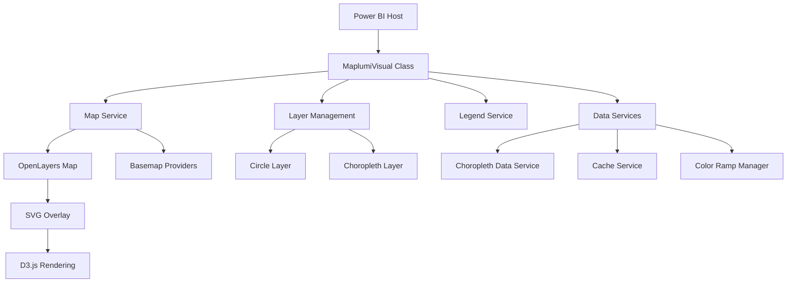

# Maplumi Power BI Visual - Main Specification

## Overview

Maplumi is a comprehensive Power BI custom visual for advanced geographic data visualization. It combines interactive mapping capabilities with sophisticated data rendering techniques, supporting both choropleth (area-based) and proportional circle visualizations with intelligent scaling and adaptive features.

## Table of Contents

1. [Visual Architecture](#visual-architecture)
2. [Core Features](#core-features)
3. [Data Model](#data-model)
4. [Visualization Types](#visualization-types)
5. [Services Architecture](#services-architecture)
6. [Configuration System](#configuration-system)
7. [Integration Points](#integration-points)
8. [Performance Considerations](#performance-considerations)

---

## Visual Architecture

### Core Framework



### Technology Stack

- **Framework**: Power BI Visual API v5.11.0
- **Mapping Engine**: OpenLayers v10.3.1
- **Data Visualization**: D3.js v7.9.0
- **Spatial Operations**: Turf.js v7.2.0
- **Color Management**: Chroma.js v3.1.2
- **Statistics**: Simple Statistics v7.8.7
- **Spatial Indexing**: RBush v4.0.1

### Class Hierarchy

```typescript
class MaplumiVisual implements IVisual {
    // Core Power BI visual implementation
    
    // Primary Components
    private mapService: MapService;
    private legendService: LegendService;
    private circleLayer: CircleLayer;
    private choroplethLayer: ChoroplethLayer;
    
    // Data Management
    private dataService: ChoroplethDataService;
    private cacheService: CacheService;
    private colorRampManager: ColorRampManager;
    
    // Configuration
    private visualFormattingSettingsModel: MaplumiVisualFormattingSettingsModel;
}
```

---

## Core Features

### 1. Interactive Mapping

- **Basemap Support**: OpenStreetMap, Mapbox, MapTiler, or no basemap
- **Pan & Zoom**: Full interactive navigation with zoom controls
- **Extent Management**: Automatic fitting and manual extent locking
- **Responsive Design**: Adapts to container size changes

### 2. Dual Visualization Modes

#### Proportional Circles
- Single value circles with adaptive scaling
- Nested circles for dual-value relationships
- Donut/pie chart circles for proportional data
- Intelligent outlier handling with compressed scaling

#### Choropleth Mapping
- Area-based data visualization using GeoJSON boundaries
- Statistical classification methods (Equal Interval, Quantile, Natural Breaks)
- Dynamic color ramp application
- Spatial indexing for performance optimization

### 3. Advanced Legend System

- **Proportional Legends**: Mathematically precise size relationships
- **Choropleth Legends**: Color-coded value ranges with customizable formatting
- **Adaptive Generation**: Automatically adjusts to outlier detection
- **Positioning Control**: Flexible legend placement and styling

### 4. Data Processing Pipeline


---

## Data Model

### Required Data Roles

#### Geographic Coordinates
- **Longitude**: Decimal degrees (WGS84)
- **Latitude**: Decimal degrees (WGS84)

#### Value Fields
- **Size (Primary)**: Numeric values for circle scaling
- **Size (Secondary)**: Optional second numeric value for nested visualizations
- **Choropleth Value**: Numeric values for area coloring
- **Location Code**: Administrative codes for choropleth boundary matching

#### Optional Fields
- **Tooltips**: Additional fields for hover information
- **Category**: Grouping fields for data segmentation

### Data Processing

```typescript
interface ProcessedData {
    coordinates: [number, number][];
    circleValues: {
        primary: number[];
        secondary?: number[];
    };
    choroplethValues: {
        locationCodes: string[];
        measureValues: number[];
    };
    tooltipData: any[][];
}
```

---

## Visualization Types

### 1. Proportional Circles

#### Single Value Circles
- **Purpose**: Display single metric spatially
- **Scaling**: Square-root scaling for perceptual accuracy
- **Features**: Adaptive outlier handling, configurable size ranges

#### Nested Circles
- **Purpose**: Compare two related metrics
- **Rendering**: Concentric circles with independent scaling
- **Use Case**: Inner/outer relationships, before/after comparisons

#### Donut Chart Circles
- **Purpose**: Show part-to-whole relationships
- **Calculation**: Angular segments based on value proportions
- **Enhancement**: Total size reflects combined magnitude

### 2. Choropleth Maps

#### Statistical Classification
- **Equal Interval**: Fixed value ranges
- **Quantile**: Equal data point distribution
- **Natural Breaks**: Jenks natural breaks optimization

#### Color Management
- **Built-in Ramps**: 15+ predefined color schemes
- **Custom Ramps**: User-defined color sequences
- **Accessibility**: ColorBrewer-inspired palettes

---

## Services Architecture

### MapService
- **Purpose**: Core OpenLayers map management
- **Responsibilities**:
  - Map initialization and configuration
  - Basemap provider integration
  - View management and extent control
  - Zoom control visibility

### LegendService
- **Purpose**: Dynamic legend generation and positioning
- **Features**:
  - Proportional circle legends with exact size matching
  - Choropleth legends with value range display
  - Flexible positioning and styling
  - Responsive text formatting

### ChoroplethDataService
- **Purpose**: Boundary data retrieval and processing
- **Capabilities**:
  - Async GeoJSON fetching from external sources
  - Data caching for performance
  - Spatial-attribute joining
  - Error handling and fallbacks

### ColorRampManager
- **Purpose**: Color scheme management and application
- **Functions**:
  - Color ramp selection and validation
  - Custom color ramp parsing
  - Value-to-color mapping
  - Accessibility considerations

### CacheService
- **Purpose**: Intelligent caching for external resources
- **Benefits**:
  - Reduced API calls for boundary data
  - Improved performance for repeated visualizations
  - Memory-efficient storage
  - Cache invalidation strategies

---

## Configuration System

### Formatting Settings Model

The visual uses Power BI's formatting model with organized setting groups:

#### Basemap Settings
```typescript
class BasemapVisualCardSettings extends formattingSettings.SimpleCard {
    basemapSelectSettingsGroup: basemapSelectSettingsGroup;
    mapBoxSettingsGroup: mapBoxSettingsGroup;
    maptilerSettingsGroup: maptilerSettingsGroup;
}
```

#### Circle Settings
```typescript
class CircleVisualCardSettings extends formattingSettings.SimpleCard {
    proportionalCirclesDisplaySettingsGroup: proportionalCirclesDisplaySettingsGroup;
    proportionalCirclesLegendSettingsGroup: proportionalCirclesLegendSettingsGroup;
}
```

#### Choropleth Settings
```typescript
class ChoroplethVisualCardSettings extends formattingSettings.SimpleCard {
    choroplethLocationBoundarySettingsGroup: choroplethLocationBoundarySettingsGroup;
    choroplethClassificationSettingsGroup: choroplethClassificationSettingsGroup;
    choroplethDisplaySettingsGroup: choroplethDisplaySettingsGroup;
    choroplethLegendSettingsGroup: choroplethLegendSettingsGroup;
}
```

#### Map Control Settings
```typescript
class MapControlsVisualCardSettings extends formattingSettings.SimpleCard {
    mapToolsSettingsGroup: mapToolsSettingsGroup;
    legendContainerSettingsGroup: legendContainerSettingsGroup;
}
```

### Configuration Options Structure

```typescript
interface VisualOptions {
    basemap: BasemapOptions;
    circles: CircleOptions;
    choropleth: ChoroplethOptions;
    mapTools: MapToolsOptions;
    legend: LegendOptions;
}
```

---

## Integration Points

### Power BI Host Integration

#### Selection Management
- Bi-directional selection sync between visual and Power BI
- Cross-filtering support across multiple visualizations
- Selection state persistence across updates

#### Tooltip Integration
- Native Power BI tooltip service integration
- Custom tooltip content with geographic context
- Rich formatting for numeric values

#### Event Handling
- Rendering lifecycle events (start/finish)
- User interaction events (click, hover, selection)
- Data update notifications

### External Data Sources

#### Boundary Data Integration
- REST API endpoints for GeoJSON boundary data
- Configurable endpoint URLs for different administrative levels
- Fallback mechanisms for connectivity issues

#### Basemap Providers
- **Mapbox**: Style-based tile serving with access token authentication
- **MapTiler**: Custom map styles with API key integration
- **OpenStreetMap**: Open-source tile serving (no authentication)

---

## Performance Considerations

### Rendering Optimization

1. **Spatial Indexing**: RBush spatial index for fast hit-testing
2. **Feature Simplification**: Turf.js simplification for complex geometries
3. **Level-of-Detail**: Adaptive rendering based on zoom level
4. **SVG Optimization**: Efficient D3.js selection and data binding

### Memory Management

1. **Data Caching**: Intelligent caching with size limits
2. **Layer Management**: On-demand layer creation and destruction
3. **Event Cleanup**: Proper event listener cleanup on visual destruction
4. **Abort Controllers**: Request cancellation for interrupted operations

### Data Volume Handling

1. **Batch Processing**: Efficient processing of large datasets
2. **Progressive Rendering**: Chunked rendering for smooth user experience
3. **Data Filtering**: Early filtering of invalid/irrelevant data points
4. **Memory-Efficient Structures**: Optimized data structures for spatial operations

---

## Error Handling & Resilience

### Data Validation
- Comprehensive validation of geographic coordinates
- Numeric value range checking and sanitization
- Graceful handling of missing or invalid data

### Network Resilience
- Retry mechanisms for failed boundary data requests
- Timeout handling for slow network connections
- Fallback options when external services are unavailable

### User Feedback
- Clear error messages for configuration issues
- Visual indicators for loading states
- Graceful degradation when features are unavailable

---

## Development Workflow

### Build System
```bash
# Development server
npm run start

# Production package
npm run package

# Code quality
npm run lint
```

### Testing Strategy
- Unit tests for core algorithms (scaling, classification)
- Integration tests for service interactions
- Visual regression tests for rendering consistency
- Performance benchmarks for large datasets

---

## Future Enhancements

### Planned Features
1. **Real-time Data**: WebSocket integration for live data updates
2. **Advanced Analytics**: Built-in spatial analysis tools
3. **Export Capabilities**: High-resolution image and PDF export
4. **Animation Support**: Temporal data visualization with smooth transitions
5. **3D Visualization**: Elevation-based data representation

### Performance Improvements
1. **WebGL Rendering**: Hardware-accelerated rendering for massive datasets
2. **Worker Threads**: Background processing for heavy computations
3. **Streaming Data**: Progressive data loading for large datasets
4. **Clustering**: Automatic point clustering for dense visualizations

---

*This specification serves as the primary reference for the Maplumi Power BI visual architecture and should be updated as the implementation evolves.*
