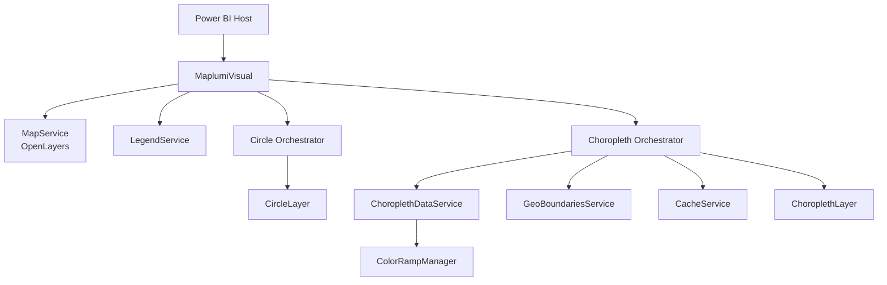
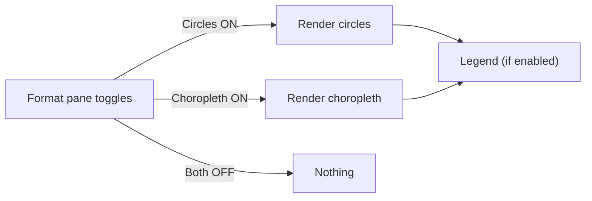

# Maplumi Visual — Specs (Concise)

Quick, diagram-first overview. Use the quick references when building, and the full specs for details.

## TL;DR
- Circles: single, nested, or donut. Smart scaling, selection, exact legend match.
- Choropleth: GeoBoundaries or custom Geo/TopoJSON. Equal interval, quantile, or natural breaks.
- Basemaps: OSM, Mapbox, MapTiler, or none. Zoom controls optional.
- Rendering: SVG (default), Canvas (fast), WebGL preview for circles with automatic fallback.
- Network: HTTPS-only boundary fetch, open-redirect guard, 25s timeout, caching.

Docs
- Choropleth quick reference → ./choropleth/quick-reference.md
- Scaled circles quick reference → ./scaled-circles/quick-reference.md
- Choropleth spec → ./choropleth/choropleth-specification.md
- Scaled circles spec → ./scaled-circles/scaled-circles-specification.md

## Architecture

## What renders when

## Minimal setup
- Circles: bind Longitude, Latitude, and a numeric Size.
- Choropleth: bind AdminPCodeNameID and a numeric Choropleth Value.
- Pick basemap, then enable “Show legend” on layers as needed.

## Tips
- Custom color ramps: comma-separated hex (e.g., #fee,#f55,#900).
- Zoom-to-layer works for all engines; disable via “Lock map extent”.
- WebGL mode: circles use WebGL when available; choropleth renders via Canvas.

## Troubleshooting
- No circles: ensure both Lat/Lon are bound.
- No choropleth: verify AdminPCodeNameID matches boundary field.
- URL blocked: ensure direct HTTPS and remove redirect params.

## Tech stack
- Power BI Visuals API, OpenLayers, D3, chroma.js, simple-statistics. Jest + pbiviz toolchain.
