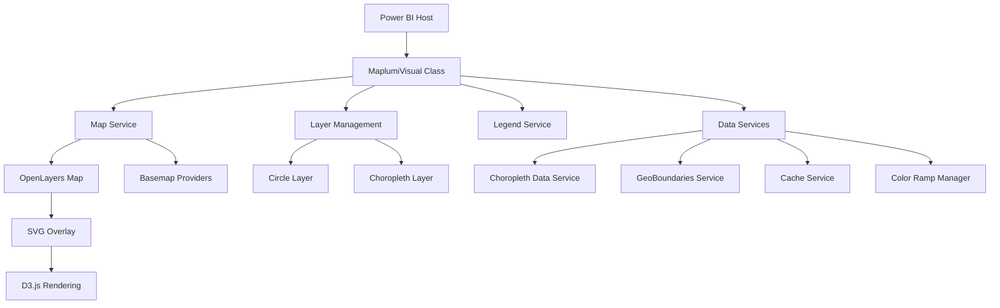

# Maplumi Power BI Visual - Main Specification

## Overview

Maplumi is a comprehensive Power BI custom visual for advanced geographic data visualization. It combines interactive mapping capabilities with sophisticated data rendering techniques, supporting both choropleth (area-based) and proportional circle visualizations with intelligent scaling and adaptive features.

## Quick Start Guide

### What Can Maplumi Do?
- **Proportional Circles**: Display data as circles sized by values with support for single, nested, or donut chart circles
- **Choropleth Maps**: Color administrative boundaries based on data values with built-in GeoBoundaries integration
- **Interactive Mapping**: Pan, zoom, and explore data with multiple basemap options
- **Smart Legends**: Automatically generated legends that adapt to your data

### Basic Setup
1. Add longitude and latitude fields to place your data geographically
2. Choose your visualization type: circles or choropleth areas
3. Add value fields for sizing (circles) or coloring (choropleth)
4. Configure styling and legends through the format pane

---

## Feature Documentation

### 🗺️ [Choropleth Mapping](#choropleth-mapping)
**Color administrative boundaries based on data values**
- Built-in access to 91+ countries' boundaries via GeoBoundaries
- Support for custom boundary data (GeoJSON/TopoJSON)
- Statistical classification methods and color schemes

### 🔵 [Proportional Circles](#proportional-circles)
**Display data as sized circles with advanced scaling**
- Single value circles with outlier handling
- Nested circles for dual-value comparisons
- Donut chart circles for part-to-whole relationships

### 🖼️ [Interactive Basemaps](#interactive-basemaps)
**Choose from multiple map styles and providers**
- OpenStreetMap (free, no API key required)
- Mapbox (custom styles with API key)
- MapTiler (premium styles with API key)

### 📊 [Smart Legends](#smart-legends)
**Automatically generated, mathematically precise legends**
- Proportional circle legends with exact size relationships
- Choropleth legends with value ranges and colors
- Flexible positioning and styling options

### 📋 [Data Requirements](#data-requirements)
**Understand what data you need for each visualization type**
- Geographic coordinates (longitude/latitude)
- Value fields for sizing and coloring
- Location codes for boundary matching

---

## Technical Reference

<details>
<summary><strong>🏗️ Architecture & Services</strong></summary>

### [System Architecture](#system-architecture)
- Component structure and relationships
- Technology stack and dependencies
- Class hierarchy and design patterns

### [Services Documentation](#services-documentation)
- MapService, LegendService, ChoroplethDataService
- GeoBoundariesService and API integration
- CacheService and ColorRampManager

</details>

<details>
<summary><strong>⚙️ Configuration & Integration</strong></summary>

### [Power BI Integration](#power-bi-integration)
- Data roles and capabilities
- Required privileges (WebAccess, LocalStorage, ExportContent)
- Selection management and tooltip integration

### [External Services](#external-services)
- API key management and security
- Boundary data sources and providers
- Network resilience and error handling

</details>

<details>
<summary><strong>🚀 Performance & Development</strong></summary>

### [Performance Optimization](#performance-optimization)
- Rendering optimization and spatial indexing
- Memory management and data volume handling
- Caching strategies and network efficiency

### [Development Workflow](#development-workflow)
- Build system and testing strategy
- Code quality and deployment process
- Future enhancements and roadmap

</details>

---

## Choropleth Mapping

### Overview
Choropleth maps visualize data by coloring administrative boundaries (countries, states, counties, etc.) based on data values. Maplumi provides built-in access to standardized boundary data and supports custom sources.

### Key Features
- **Integrated GeoBoundaries Support**: Built-in access to 91+ countries' administrative boundaries
- **Multiple Data Sources**: GeoBoundaries API or custom TopoJSON/GeoJSON URLs
- **Dynamic Field Mapping**: Automatic field options based on data source selection
- **Statistical Classification**: Equal Interval, Quantile, Natural Breaks methods
- **Smart Color Management**: 15+ built-in color schemes with accessibility considerations

### Data Requirements
1. **Location Codes**: Administrative codes that match your boundary data
   - For GeoBoundaries: ISO codes, names, or administrative IDs
   - For custom data: any field that matches your boundary dataset
2. **Values**: Numeric data to determine color intensity
3. **Optional**: Additional fields for tooltips and categorization

### Configuration Options

#### Boundary Data Source Selection
```typescript
// Built-in GeoBoundaries (Recommended)
boundaryDataSource: "GeoBoundaries"
geoBoundariesCountry: "USA" | "GBR" | "FRA" | "All Countries" | ... // 91+ options
geoBoundariesReleaseType: "gbOpen" | "gbHumanitarian" | "gbAuthoritative"
geoBoundariesAdminLevel: "ADM0" | "ADM1" | "ADM2" | "ADM3"
boundaryIdField: "shapeISO" | "shapeName" | "shapeID" | "shapeGroup"

// Custom Boundary Data
boundaryDataSource: "Custom"
topoJSON_geoJSON_FileUrl: "https://example.com/boundaries.geojson"
customBoundaryIdField: "FIPS_CODE" // Field in your custom data
```

#### GeoBoundaries Integration Details
- **Coverage**: 91+ countries with comprehensive administrative boundaries
- **Release Types**: 
  - **gbOpen** (CC-BY 4.0): General use with fastest updates
  - **gbHumanitarian** (UN OCHA): Optimized for humanitarian operations
  - **gbAuthoritative** (UN SALB): Official government boundaries
- **Administrative Levels**: ADM0 (countries) through ADM3 (municipalities)
- **Global Support**: Special "All Countries" dataset for worldwide visualizations

#### Classification Methods
- **Equal Interval**: Fixed value ranges across the data distribution
- **Quantile**: Equal number of data points in each class
- **Natural Breaks**: Jenks optimization for natural groupings

#### Color Schemes
- Built-in ColorBrewer-inspired palettes for accessibility
- Custom color ramp support with user-defined sequences
- Automatic color-to-value mapping based on classification method

### Best Practices
1. **Data Quality**: Ensure location codes match exactly with boundary data
2. **Coverage**: Verify boundary data covers all your locations
3. **Performance**: Use GeoBoundaries for standardized, cached boundaries
4. **Classification**: Choose methods appropriate for your data distribution
5. **Colors**: Select color schemes appropriate for your data type and audience

> **📋 Detailed Reference**: See [choropleth-specification.md](choropleth/choropleth-specification.md) for complete technical documentation

---

## Proportional Circles

### Overview
Proportional circles display data as circles sized according to numeric values, providing an intuitive way to show magnitude differences across geographic locations.

### Circle Types

#### Single Value Circles
- **Purpose**: Display one metric spatially
- **Scaling**: Square-root scaling for perceptual accuracy
- **Features**: Adaptive outlier handling, configurable size ranges

#### Nested Circles
- **Purpose**: Compare two related metrics
- **Rendering**: Concentric circles with independent scaling
- **Use Cases**: Inner/outer relationships, before/after comparisons

#### Donut Chart Circles
- **Purpose**: Show part-to-whole relationships
- **Calculation**: Angular segments based on value proportions
- **Enhancement**: Total size reflects combined magnitude

### Data Requirements
1. **Geographic Coordinates**: Longitude and latitude (decimal degrees, WGS84)
2. **Size Values**: 
   - Primary: Required numeric values for circle sizing
   - Secondary: Optional second values for nested visualizations
3. **Optional**: Additional fields for tooltips and categorization

### Scaling Algorithms

#### Outlier Handling
- **Detection**: Statistical methods to identify extreme values
- **Compression**: Logarithmic scaling for outlier accommodation
- **Transparency**: Clear visual indication of scaling adjustments

#### Size Calculation
```typescript
// Square-root scaling for perceptual accuracy
circleRadius = Math.sqrt(dataValue / maxValue) * maxRadius;

// Outlier compression when enabled
if (outlierDetected && compressionEnabled) {
    circleRadius = Math.log(dataValue + 1) / Math.log(maxValue + 1) * maxRadius;
}
```

### Configuration Options
- **Size Range**: Minimum and maximum circle sizes
- **Outlier Handling**: Enable/disable compression algorithms
- **Styling**: Fill colors, stroke properties, opacity
- **Interaction**: Hover effects and selection behavior

> **📋 Detailed Reference**: See [scaled-circles-specification.md](scaled-circles/scaled-circles-specification.md) for complete technical documentation

---

## Interactive Basemaps

### Overview
Basemaps provide geographic context for your data visualizations. Maplumi supports multiple providers with different styling options and authentication requirements.

### Basemap Providers

#### OpenStreetMap (Free)
- **Features**: Community-maintained, worldwide coverage
- **Cost**: Free, no API key required
- **Styles**: Standard OSM style
- **Best For**: General use, development, cost-sensitive projects

#### Mapbox (Premium)
- **Features**: Custom styles, high-performance tiles
- **Authentication**: Requires Mapbox access token
- **Styles**: Wide variety including satellite, terrain, custom designs
- **Best For**: Professional applications, custom branding

#### MapTiler (Premium)
- **Features**: High-quality cartography, multiple styles
- **Authentication**: Requires MapTiler API key
- **Styles**: Streets, satellite, terrain, vintage, and more
- **Best For**: High-quality visualizations, European focus

#### No Basemap
- **Features**: Plain background for data focus
- **Performance**: Fastest rendering, lowest bandwidth
- **Best For**: Dense data, presentation focus on data patterns

### API Key Management

API keys for premium providers (Mapbox, MapTiler) are managed through Power BI's formatting settings:

1. **User Input**: Enter API keys through text fields in the Power BI format pane
2. **Security**: Keys are stored within Power BI's secure settings system
3. **Transmission**: Keys are sent directly to tile providers over HTTPS
4. **Scope**: Keys are scoped to the specific visual instance and report
5. **Access Control**: Only users with edit permissions can view/modify keys

### Map Controls
- **Pan & Zoom**: Full interactive navigation
- **Zoom Controls**: Optional +/- buttons for zoom control
- **Extent Management**: Automatic fitting or manual extent locking
- **Responsive Design**: Adapts to container size changes

---

## Smart Legends

### Overview
Maplumi automatically generates mathematically precise legends that adapt to your data and visualization choices.

### Legend Types

#### Proportional Circle Legends
- **Size Accuracy**: Exact mathematical relationship between legend and data circles
- **Value Display**: Clear numeric labels showing size relationships
- **Adaptive Generation**: Automatically adjusts to outlier detection and scaling

#### Choropleth Legends
- **Color-Coded Ranges**: Visual representation of data classification
- **Value Ranges**: Clear display of minimum and maximum values for each class
- **Classification Method**: Indicates which statistical method was used

### Positioning & Styling
- **Flexible Placement**: Top, bottom, left, right positioning
- **Size Control**: Adjustable legend dimensions
- **Font Styling**: Customizable text appearance
- **Background Options**: Transparent or solid backgrounds

### Dynamic Behavior
- **Data-Driven**: Legends update automatically when data changes
- **Method-Aware**: Adapts to different classification and scaling methods
- **Responsive**: Adjusts to available space and visual container size

---

## Data Requirements

### Geographic Coordinates
- **Longitude**: Decimal degrees (WGS84 coordinate system)
- **Latitude**: Decimal degrees (WGS84 coordinate system)
- **Format**: Standard numeric fields from Power BI data sources
- **Validation**: Automatic range checking (-180 to 180 for longitude, -90 to 90 for latitude)

### Value Fields

#### For Proportional Circles
- **Size (Primary)**: Required numeric values for circle scaling
- **Size (Secondary)**: Optional second numeric value for nested visualizations
- **Supported Types**: Integer, decimal, currency, percentage measures

#### For Choropleth Maps
- **Choropleth Value**: Numeric values for area coloring
- **Location Code**: Administrative codes for boundary matching
  - GeoBoundaries: Supports shapeISO, shapeName, shapeID, shapeGroup formats
  - Custom Data: Any field that matches your boundary dataset
- **Supported Types**: All numeric measure types

### Optional Fields
- **Tooltips**: Additional fields for hover information display
- **Category**: Grouping fields for data segmentation and filtering
- **Custom Labels**: Override default tooltip content

### Data Quality Guidelines
1. **Completeness**: Ensure geographic coordinates are present for all data points
2. **Accuracy**: Verify coordinate precision appropriate for your analysis scale
3. **Consistency**: Use consistent location code formats for choropleth mapping
4. **Validation**: Check for outliers that might affect scaling and classification

---

## System Architecture

### Core Framework



### Technology Stack

- **Framework**: Power BI Visual API v5.11.0
- **Mapping Engine**: OpenLayers v10.3.1
- **Data Visualization**: D3.js v7.9.0
- **Spatial Operations**: Turf.js v7.2.0
- **Color Management**: Chroma.js v3.1.2
- **Statistics**: Simple Statistics v7.8.7
- **Spatial Indexing**: RBush v4.0.1

### Component Architecture

```typescript
class MaplumiVisual implements IVisual {
    // Core Power BI visual implementation
    
    // Primary Components
    private mapService: MapService;
    private legendService: LegendService;
    private circleLayer: CircleLayer;
    private choroplethLayer: ChoroplethLayer;
    
    // Data Management
    private dataService: ChoroplethDataService;
    private geoBoundariesService: GeoBoundariesService;
    private cacheService: CacheService;
    private colorRampManager: ColorRampManager;
    
    // Configuration
    private visualFormattingSettingsModel: MaplumiVisualFormattingSettingsModel;
}
```

### Data Processing Pipeline


---

## Services Documentation

### MapService
**Core OpenLayers map management and basemap integration**

- **Responsibilities**:
  - Map initialization and configuration
  - Basemap provider integration (OSM, Mapbox, MapTiler)
  - View management and extent control
  - Zoom control visibility and interaction
  - Coordinate system handling and projections

### LegendService
**Dynamic legend generation and positioning**

- **Features**:
  - Proportional circle legends with exact size matching
  - Choropleth legends with value range display
  - Flexible positioning and styling options
  - Responsive text formatting and layout
  - Mathematical precision in size/color relationships

### ChoroplethDataService
**Boundary data retrieval and processing**

- **Capabilities**:
  - Async boundary data fetching from multiple sources
  - GeoBoundaries API integration with 91+ country support
  - Custom TopoJSON/GeoJSON URL processing
  - Data caching for performance optimization
  - Spatial-attribute joining and validation
  - Error handling and fallback mechanisms

### GeoBoundariesService
**GeoBoundaries API integration and management**

- **Features**:
  - Dynamic API URL construction for different release types
  - Metadata fetching and validation
  - Support for gbOpen, gbHumanitarian, and gbAuthoritative releases
  - "All Countries" aggregated dataset handling
  - Field mapping for shapeISO, shapeName, shapeID, and shapeGroup
  - Administrative level validation (ADM0-ADM3)

### ColorRampManager
**Color scheme management and application**

- **Functions**:
  - Color ramp selection and validation
  - Custom color ramp parsing and application
  - Value-to-color mapping with interpolation
  - Accessibility considerations and contrast validation
  - ColorBrewer palette integration

### CacheService
**Intelligent caching for external resources**

- **Benefits**:
  - Reduced API calls for boundary data
  - Improved performance for repeated visualizations
  - Memory-efficient storage with size limits
  - Cache invalidation strategies
  - Cross-session persistence via LocalStorage

---

## Power BI Integration

### Data Roles Configuration

The visual defines specific data roles for optimal Power BI integration:

```typescript
interface DataRoles {
    AdminPCodeNameID: string;    // Boundary ID for choropleth mapping
    Longitude: number;           // Geographic X coordinate (decimal degrees)
    Latitude: number;            // Geographic Y coordinate (decimal degrees)
    Size: number;               // Circle size values (supports up to 2 measures)
    Color: number;              // Choropleth color values
    Tooltips: any;              // Additional tooltip information
}
```

### Required Privileges

#### WebAccess Privilege
Essential for accessing external mapping and boundary data services:

**Map Tile Providers:**
- `https://*.openstreetmap.org` - OpenStreetMap tile servers
- `https://*.arcgisonline.com` - ESRI ArcGIS Online services
- `https://*.arcgis.com` - ESRI ArcGIS services
- `https://*.mapbox.com` - Mapbox map tiles and APIs
- `https://api.maptiler.com` - MapTiler API and tile services

**Boundary Data Sources:**
- `https://*.humdata.org` - Humanitarian Data Exchange (HDX)
- `https://*.itos.uga.edu` - University of Georgia GeoBoundaries project
- `https://*.datauga.com` - Custom GeoBoundaries aggregated datasets

**General Web Services:**
- `https://*.githubusercontent.com` - GitHub raw content for boundary files
- `https://*.googleapis.com` - Google APIs and services
- `https://*.amazonaws.com` - Amazon Web Services hosted data
- `https://*.blob.core.windows.net` - Azure Blob Storage
- `https://*.github.io` - GitHub Pages hosted content
- `https://*.cloudfront.net` - Amazon CloudFront CDN
- `https://*.r2.dev` - Cloudflare R2 storage

#### LocalStorage Privilege
Essential for caching boundary data and user preferences:
- Boundary data caching for reduced API calls and improved performance
- User settings persistence for map view state and configuration
- Offline-capable visualization for cached data

#### ExportContent Privilege
Essential for Power BI export functionality:
- Report export with visual inclusion in PDF/PowerPoint exports
- High-resolution output support for print-quality map visualizations
- Data preservation and visual fidelity across export formats

### Selection Management
- **Bi-directional Sync**: Selection sync between visual and Power BI
- **Cross-filtering**: Support across multiple visualizations in the report
- **State Persistence**: Selection state maintained across data updates

### Tooltip Integration
- **Native Integration**: Power BI tooltip service integration
- **Custom Content**: Geographic context and rich formatting
- **Performance**: Optimized tooltip rendering for large datasets

---

## External Services

### API Key Security Model

In Power BI visuals, API keys are handled through the formatting settings system:

1. **User Input**: API keys are entered by users through text input fields in the Power BI format pane
2. **Storage**: Keys are stored within the Power BI report/dataset as part of the visual's configuration
3. **Transmission**: Keys are securely transmitted to external services (Mapbox, MapTiler) over HTTPS
4. **Scope**: API keys are scoped to the specific visual instance and report
5. **Access Control**: Only users with edit permissions on the report can view/modify API keys
6. **No Server Storage**: The visual itself doesn't store API keys; they're managed by Power BI's settings system

```typescript
// API keys are accessed through Power BI's formatting settings
const mapboxAccessToken = basemapSettings.mapBoxSettingsGroup.mapboxAccessToken.value.toString();
const maptilerApiKey = basemapSettings.maptilerSettingsGroup.maptilerApiKey.value.toString();

// Keys are used directly in tile service requests
const tileUrl = `https://api.maptiler.com/maps/${style}/tiles.json?key=${maptilerApiKey}`;
```

### Network Resilience
- **Retry Mechanisms**: Automatic retry for failed requests with exponential backoff
- **Timeout Handling**: Configurable timeouts for slow network connections
- **Fallback Options**: Graceful degradation when external services are unavailable
- **Error Recovery**: Clear error messages and recovery suggestions

### Security Considerations
- **HTTPS Only**: All external requests use HTTPS for secure data transmission
- **Domain Whitelisting**: Access limited to specified domain patterns
- **No Sensitive Data**: No authentication data transmitted to unauthorized endpoints
- **Sandboxed Storage**: LocalStorage access is sandboxed to the visual's domain context

---

## Performance Optimization

### Rendering Optimization

1. **Spatial Indexing**: RBush spatial index for fast hit-testing and collision detection
2. **Feature Simplification**: Turf.js simplification for complex geometries based on zoom level
3. **Level-of-Detail**: Adaptive rendering quality based on current map zoom
4. **SVG Optimization**: Efficient D3.js selection and data binding patterns

### Memory Management

1. **Data Caching**: Intelligent caching with configurable size limits and TTL
2. **Layer Management**: On-demand layer creation and destruction
3. **Event Cleanup**: Proper event listener cleanup on visual destruction
4. **Abort Controllers**: Request cancellation for interrupted operations

### Data Volume Handling

1. **Batch Processing**: Efficient processing of large datasets in chunks
2. **Progressive Rendering**: Chunked rendering for smooth user experience
3. **Data Filtering**: Early filtering of invalid/irrelevant data points
4. **Memory-Efficient Structures**: Optimized data structures for spatial operations

### Caching Strategies

1. **Boundary Data**: Long-term caching of static boundary geometries
2. **Tile Caching**: Browser-level caching of map tiles
3. **Computation Results**: Caching of expensive calculations (classifications, statistics)
4. **Configuration State**: Persistent storage of user preferences and settings

---

## Development Workflow

### Build System
```bash
# Development server with hot reload
npm run start

# Production package creation
npm run package

# Code quality checks
npm run lint

# Test suite execution
npm test
```

### Testing Strategy
- **Unit Tests**: Core algorithms (scaling, classification, spatial operations)
- **Integration Tests**: Service interactions and data flow
- **Visual Regression Tests**: Rendering consistency across updates
- **Performance Benchmarks**: Large dataset handling and memory usage

### Configuration System

The visual uses Power BI's formatting model with organized setting groups:

#### Settings Structure
```typescript
class MaplumiVisualFormattingSettingsModel extends FormattingSettingsModel {
    // Basemap configuration
    basemapSettings: BasemapVisualCardSettings;
    
    // Circle visualization settings
    circleSettings: CircleVisualCardSettings;
    
    // Choropleth visualization settings
    choroplethSettings: ChoroplethVisualCardSettings;
    
    // Map controls and tools
    mapControlsSettings: MapControlsVisualCardSettings;
}
```

#### Choropleth Boundary Configuration
```typescript
class choroplethLocationBoundarySettingsGroup extends formattingSettings.SimpleCard {
    boundaryDataSource: DropDown;        // GeoBoundaries or Custom
    geoBoundariesCountry: DropDown;      // 91+ countries + "All Countries"
    geoBoundariesReleaseType: DropDown;  // gbOpen, gbHumanitarian, gbAuthoritative
    geoBoundariesAdminLevel: DropDown;   // ADM0-ADM3 with conditional restrictions
    boundaryIdField: DropDown;           // Dynamic field options based on source
    customBoundaryIdField: TextInput;    // Custom field mapping for non-GeoBoundaries
    topoJSON_geoJSON_FileUrl: TextInput; // Custom boundary data URL
}
```

### Error Handling & User Feedback
- **Data Validation**: Comprehensive validation with clear error messages
- **Loading States**: Visual indicators for network operations
- **Graceful Degradation**: Fallback rendering when features are unavailable
- **User Guidance**: Contextual help and configuration suggestions

---

## Future Enhancements

### Planned Features
1. **Real-time Data**: WebSocket integration for live data updates
2. **Advanced Analytics**: Built-in spatial analysis tools (clustering, hotspots)
3. **Enhanced Export**: High-resolution image and PDF export capabilities
4. **Animation Support**: Temporal data visualization with smooth transitions
5. **3D Visualization**: Elevation-based data representation and terrain mapping

### Performance Improvements
1. **WebGL Rendering**: Hardware-accelerated rendering for massive datasets
2. **Worker Threads**: Background processing for heavy spatial computations
3. **Streaming Data**: Progressive data loading for very large datasets
4. **Advanced Clustering**: Automatic point clustering for dense visualizations

### Enhanced Integration
1. **Power BI Service**: Deeper integration with Power BI service features
2. **Custom Themes**: Enhanced theming support for enterprise branding
3. **Accessibility**: Improved screen reader support and keyboard navigation
4. **Mobile Optimization**: Enhanced touch interaction and responsive design

---

*This specification serves as the primary reference for the Maplumi Power BI visual architecture. Recent major updates include integrated GeoBoundaries API support, streamlined boundary data configuration, dynamic field mapping, and enhanced user experience with conditional UI elements. The specification is organized with progressive disclosure to serve both end users and developers effectively.*
