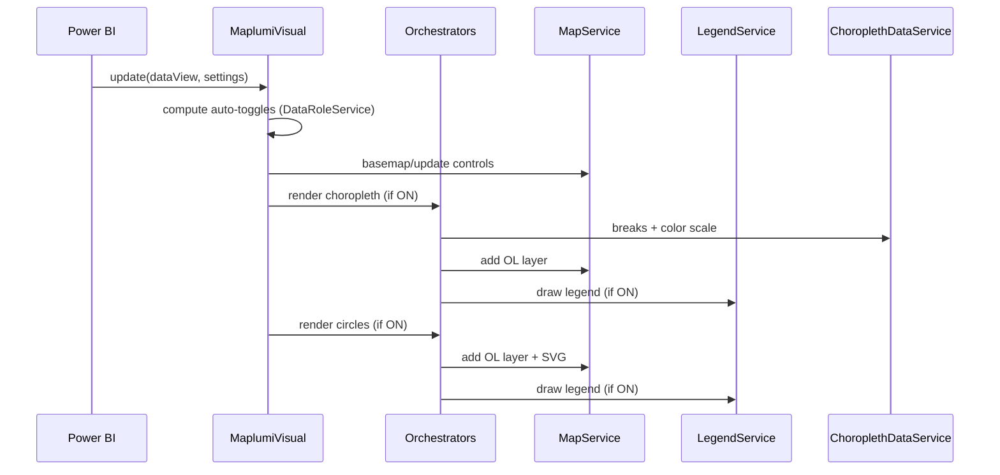

# Maplumi Power BI Visual — Diagram-First Spec

This is a short, diagram-first overview of the visual. Use it to orient quickly; jump into the quick references when you need details.

## TL;DR
- Circles: Single, nested, or donut; smart scaling and selection.
- Choropleth: GeoBoundaries or custom Geo/TopoJSON; multiple classification methods and ramps.
- Basemaps: OSM, Mapbox, MapTiler, or none.
- Legends: Auto-generated; configurable position and style.

Links:
- Choropleth quick reference → ./choropleth/quick-reference.md
- Scaled circles quick reference → ./scaled-circles/quick-reference.md
- Choropleth spec → ./choropleth/choropleth-specification.md
- Scaled circles spec → ./scaled-circles/scaled-circles-specification.md

---

## How it fits together

```mermaid
graph TD
  host[Power BI Host] --> visual[MaplumiVisual]
  visual --> mapSvc[MapService (OpenLayers)]
  visual --> legends[LegendService]
  visual --> circlesOrch[Circle Orchestrator]
  visual --> choroOrch[Choropleth Orchestrator]
  choroOrch --> dataSvc[ChoroplethDataService]
  choroOrch --> geoSvc[GeoBoundariesService]
  choroOrch --> cache[CacheService]
  dataSvc --> ramps[ColorRampManager]
  mapSvc --> map[OL Map + SVG Overlay]
  circlesOrch --> circleLayer[CircleLayer]
  choroOrch --> choroLayer[ChoroplethLayer]
```

## What renders when

```mermaid
flowchart LR
  A[Data roles present?] -->|Lat & Lon| B[Auto-toggle Circles ON]
  A -->|AdminPCodeNameID| C[Auto-toggle Choropleth ON]
  B --> D{User "Show layer"?}
  C --> E{User "Show layer"?}
  D -->|Yes| F[Circles render]
  D -->|No| G[Circles hidden]
  E -->|Yes| H[Choropleth render]
  E -->|No| I[Choropleth hidden]
  F --> J[Legend visible if enabled]
  H --> J
  G --> K[Legend hidden if no active layer]
  I --> K
```

## Render pipeline (simplified)



## Minimal setup
1) Circles: bind Longitude, Latitude, and a numeric Size value.
2) Choropleth: bind AdminPCodeNameID and a numeric Choropleth Value.
3) Pick basemap and toggle "Show legend" per layer.

## Tips
- Auto-toggle mirrors data roles but can be switched off in the Format pane.
- Custom color ramps accept comma-separated hex (e.g., #fee,#f55,#900).
- Legend container appears when any active layer’s legend is enabled.

## Troubleshooting at a glance
- No circles? Ensure both Lat and Lon are bound and non-empty.
- No choropleth? Check AdminPCodeNameID matches boundary source field.
- No legend? Ensure layer is ON and its "Show legend" is enabled.
- GeoBoundaries fetch issues? Try a different release type or country/admin level.

---

## Tech stack (quick)
- Power BI Visual API, OpenLayers, D3, chroma.js, simple-statistics
- Data caching, boundary fetch via GeoBoundaries
- Tested with Jest; packaged via pbiviz

### Data Processing Pipeline


---

## Services Documentation

### MapService
**Core OpenLayers map management and basemap integration**

- **Responsibilities**:
  - Map initialization and configuration
  - Basemap provider integration (OSM, Mapbox, MapTiler)
  - View management and extent control
  - Zoom control visibility and interaction
  - Coordinate system handling and projections

### LegendService
**Dynamic legend generation and positioning**

- **Features**:
  - Proportional circle legends with exact size matching
  - Choropleth legends with value range display
  - Flexible positioning and styling options
  - Responsive text formatting and layout
  - Mathematical precision in size/color relationships

### ChoroplethDataService
**Boundary data retrieval and processing**

- **Capabilities**:
  - Async boundary data fetching from multiple sources
  - GeoBoundaries API integration with 91+ country support
  - Custom TopoJSON/GeoJSON URL processing
  - Data caching for performance optimization
  - Spatial-attribute joining and validation
  - Error handling and fallback mechanisms

### GeoBoundariesService
**GeoBoundaries API integration and management**

- **Features**:
  - Dynamic API URL construction for different release types
  - Metadata fetching and validation
  - Support for gbOpen, gbHumanitarian, and gbAuthoritative releases
  - "All Countries" aggregated dataset handling
  - Field mapping for shapeISO, shapeName, shapeID, and shapeGroup
  - Administrative level validation (ADM0-ADM3)

### ColorRampManager
**Color scheme management and application**

- **Functions**:
  - Color ramp selection and validation
  - Custom color ramp parsing and application
  - Value-to-color mapping with interpolation
  - Accessibility considerations and contrast validation
  - ColorBrewer palette integration

### CacheService
**Intelligent caching for external resources**

- **Benefits**:
  - Reduced API calls for boundary data
  - Improved performance for repeated visualizations
  - Memory-efficient storage with size limits
  - Cache invalidation strategies
  - Cross-session persistence via LocalStorage

---

## Power BI Integration

### Data Roles Configuration

The visual defines specific data roles for optimal Power BI integration:

```typescript
interface DataRoles {
    AdminPCodeNameID: string;    // Boundary ID for choropleth mapping
    Longitude: number;           // Geographic X coordinate (decimal degrees)
    Latitude: number;            // Geographic Y coordinate (decimal degrees)
    Size: number;               // Circle size values (supports up to 2 measures)
    Color: number;              // Choropleth color values
    Tooltips: any;              // Additional tooltip information
}
```

### Required Privileges

#### WebAccess Privilege
Essential for accessing external mapping and boundary data services:

**Map Tile Providers:**
- `https://*.openstreetmap.org` - OpenStreetMap tile servers
- `https://*.arcgisonline.com` - ESRI ArcGIS Online services
- `https://*.arcgis.com` - ESRI ArcGIS services
- `https://*.mapbox.com` - Mapbox map tiles and APIs
- `https://api.maptiler.com` - MapTiler API and tile services

**Boundary Data Sources:**
- `https://*.humdata.org` - Humanitarian Data Exchange (HDX)
- `https://*.itos.uga.edu` - University of Georgia GeoBoundaries project
- `https://*.datauga.com` - Custom GeoBoundaries aggregated datasets

**General Web Services:**
- `https://*.githubusercontent.com` - GitHub raw content for boundary files
- `https://*.googleapis.com` - Google APIs and services
- `https://*.amazonaws.com` - Amazon Web Services hosted data
- `https://*.blob.core.windows.net` - Azure Blob Storage
- `https://*.github.io` - GitHub Pages hosted content
- `https://*.cloudfront.net` - Amazon CloudFront CDN
- `https://*.r2.dev` - Cloudflare R2 storage

#### LocalStorage Privilege
Essential for caching boundary data and user preferences:
- Boundary data caching for reduced API calls and improved performance
- User settings persistence for map view state and configuration
- Offline-capable visualization for cached data

#### ExportContent Privilege
Essential for Power BI export functionality:
- Report export with visual inclusion in PDF/PowerPoint exports
- High-resolution output support for print-quality map visualizations
- Data preservation and visual fidelity across export formats

### Selection Management
- **Bi-directional Sync**: Selection sync between visual and Power BI
- **Cross-filtering**: Support across multiple visualizations in the report
- **State Persistence**: Selection state maintained across data updates

### Tooltip Integration
- **Native Integration**: Power BI tooltip service integration
- **Custom Content**: Geographic context and rich formatting
- **Performance**: Optimized tooltip rendering for large datasets

---

## External Services

### API Key Security Model

In Power BI visuals, API keys are handled through the formatting settings system:

1. **User Input**: API keys are entered by users through text input fields in the Power BI format pane
2. **Storage**: Keys are stored within the Power BI report/dataset as part of the visual's configuration
3. **Transmission**: Keys are securely transmitted to external services (Mapbox, MapTiler) over HTTPS
4. **Scope**: API keys are scoped to the specific visual instance and report
5. **Access Control**: Only users with edit permissions on the report can view/modify API keys
6. **No Server Storage**: The visual itself doesn't store API keys; they're managed by Power BI's settings system

```typescript
// API keys are accessed through Power BI's formatting settings
const mapboxAccessToken = basemapSettings.mapBoxSettingsGroup.mapboxAccessToken.value.toString();
const maptilerApiKey = basemapSettings.maptilerSettingsGroup.maptilerApiKey.value.toString();

// Keys are used directly in tile service requests
const tileUrl = `https://api.maptiler.com/maps/${style}/tiles.json?key=${maptilerApiKey}`;
```

### Network Resilience
- **Retry Mechanisms**: Automatic retry for failed requests with exponential backoff
- **Timeout Handling**: Configurable timeouts for slow network connections
- **Fallback Options**: Graceful degradation when external services are unavailable
- **Error Recovery**: Clear error messages and recovery suggestions

### Security Considerations
- **HTTPS Only**: All external requests use HTTPS for secure data transmission
- **Domain Whitelisting**: Access limited to specified domain patterns
- **No Sensitive Data**: No authentication data transmitted to unauthorized endpoints
- **Sandboxed Storage**: LocalStorage access is sandboxed to the visual's domain context

---

## Performance Optimization

### Rendering Optimization

1. **Spatial Indexing**: RBush spatial index for fast hit-testing and collision detection
2. **Feature Simplification**: Turf.js simplification for complex geometries based on zoom level
3. **Level-of-Detail**: Adaptive rendering quality based on current map zoom
4. **SVG Optimization**: Efficient D3.js selection and data binding patterns

### Memory Management

1. **Data Caching**: Intelligent caching with configurable size limits and TTL
2. **Layer Management**: On-demand layer creation and destruction
3. **Event Cleanup**: Proper event listener cleanup on visual destruction
4. **Abort Controllers**: Request cancellation for interrupted operations

### Data Volume Handling

1. **Batch Processing**: Efficient processing of large datasets in chunks
2. **Progressive Rendering**: Chunked rendering for smooth user experience
3. **Data Filtering**: Early filtering of invalid/irrelevant data points
4. **Memory-Efficient Structures**: Optimized data structures for spatial operations

### Caching Strategies

1. **Boundary Data**: Long-term caching of static boundary geometries
2. **Tile Caching**: Browser-level caching of map tiles
3. **Computation Results**: Caching of expensive calculations (classifications, statistics)
4. **Configuration State**: Persistent storage of user preferences and settings

---

## Development Workflow

### Build System
```bash
# Development server with hot reload
npm run start

# Production package creation
npm run package

# Code quality checks
npm run lint

# Test suite execution
npm test
```

### Testing Strategy
- **Unit Tests**: Core algorithms (scaling, classification, spatial operations)
- **Integration Tests**: Service interactions and data flow
- **Visual Regression Tests**: Rendering consistency across updates
- **Performance Benchmarks**: Large dataset handling and memory usage

### Configuration System

The visual uses Power BI's formatting model with organized setting groups:

#### Settings Structure
```typescript
class MaplumiVisualFormattingSettingsModel extends FormattingSettingsModel {
    // Basemap configuration
    basemapSettings: BasemapVisualCardSettings;
    
    // Circle visualization settings
    circleSettings: CircleVisualCardSettings;
    
    // Choropleth visualization settings
    choroplethSettings: ChoroplethVisualCardSettings;
    
    // Map controls and tools
    mapControlsSettings: MapControlsVisualCardSettings;
}
```

#### Choropleth Boundary Configuration
```typescript
class choroplethLocationBoundarySettingsGroup extends formattingSettings.SimpleCard {
    boundaryDataSource: DropDown;        // GeoBoundaries or Custom
    geoBoundariesCountry: DropDown;      // 91+ countries + "All Countries"
    geoBoundariesReleaseType: DropDown;  // gbOpen, gbHumanitarian, gbAuthoritative
    geoBoundariesAdminLevel: DropDown;   // ADM0-ADM3 with conditional restrictions
    boundaryIdField: DropDown;           // Dynamic field options based on source
    customBoundaryIdField: TextInput;    // Custom field mapping for non-GeoBoundaries
    topoJSON_geoJSON_FileUrl: TextInput; // Custom boundary data URL
}
```

### Error Handling & User Feedback
- **Data Validation**: Comprehensive validation with clear error messages
- **Loading States**: Visual indicators for network operations
- **Graceful Degradation**: Fallback rendering when features are unavailable
- **User Guidance**: Contextual help and configuration suggestions

---

## Future Enhancements

### Planned Features
1. **Real-time Data**: WebSocket integration for live data updates
2. **Advanced Analytics**: Built-in spatial analysis tools (clustering, hotspots)
3. **Enhanced Export**: High-resolution image and PDF export capabilities
4. **Animation Support**: Temporal data visualization with smooth transitions
5. **3D Visualization**: Elevation-based data representation and terrain mapping

### Performance Improvements
1. **WebGL Rendering**: Hardware-accelerated rendering for massive datasets
2. **Worker Threads**: Background processing for heavy spatial computations
3. **Streaming Data**: Progressive data loading for very large datasets
4. **Advanced Clustering**: Automatic point clustering for dense visualizations

### Enhanced Integration
1. **Power BI Service**: Deeper integration with Power BI service features
2. **Custom Themes**: Enhanced theming support for enterprise branding
3. **Accessibility**: Improved screen reader support and keyboard navigation
4. **Mobile Optimization**: Enhanced touch interaction and responsive design

---

*This specification serves as the primary reference for the Maplumi Power BI visual architecture. Recent major updates include integrated GeoBoundaries API support, streamlined boundary data configuration, dynamic field mapping, and enhanced user experience with conditional UI elements. The specification is organized with progressive disclosure to serve both end users and developers effectively.*
