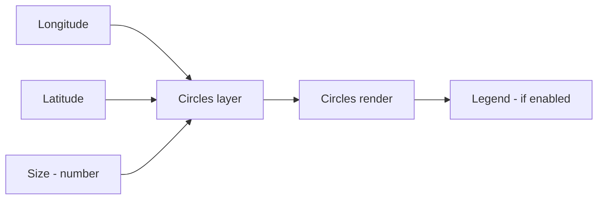
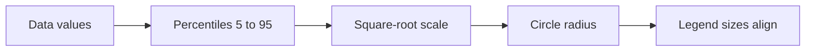

# Scaled Circles — Quick Reference (Concise)

Short guide to get scaled circles running fast. See the full spec for details: ./scaled-circles-specification.md

## What you bind



Required
- Longitude and Latitude - decimal degrees
- Size - numeric measure
- Optional - Size Secondary for nested or donut, Tooltips

## Configure in 4 steps
1) Chart type — nested-circles | donut-chart | pie-chart
2) Appearance — min/max radius, colors, stroke, opacities
3) Legend — show, title, spacing, item stroke
4) Rendering engine — SVG, Canvas, or WebGL (preview). Falls back to Canvas if WebGL is unavailable.

Minimal settings
```
Type: nested-circle
Min radius: 3  Max radius: 30
Color1: #f58220  Color2: #ffc800
Opacity: 80 percent
Legend: on  Title: Circles
```

---

## Scaling and legend - essentials

- Areas scale with data - square-root radii for perception
- Uses 5th to 95th percentile range for robust sizing
- Outliers above 95th are compressed but remain larger
- Legend circles match map sizes exactly - 100 percent - 50 percent - 25 percent diameter



---

## Quick fixes
- Too small or large - adjust min and max radius
- Overlap heavy - lower opacity or use nested circles
- Flat sizes - narrow data range - verify measure
- One huge circle - expected - outlier compression applies
- View not fitting - ensure "Lock map extent" is off; zoom-to-layer works for all engines

---

## Best practices - short
1) Min radius 3 to 5 px - Max 20 to 30 px
2) Use contrasting colors - inner and outer clearly distinct
3) Keep legend away from dense data
4) Keep Size numeric and non-negative

---

## Setup checklist

 - [ ] Longitude and Latitude bound
 - [ ] Size - and optional Secondary - set
 - [ ] Chart type and radii tuned
 - [ ] Legend enabled and titled

---

*For detailed technical information, see the Scaled Circles Specification and API notes.*
