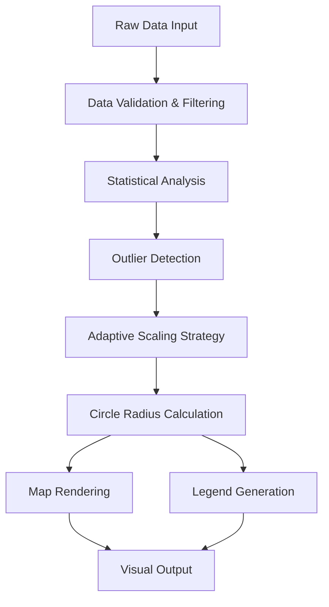

# Scaled & Nested Circles Visualization Specification

## Overview

This document describes the implementation and behavior of the scaled circle visualization system in the Maplumi Power BI visual. The system provides intelligent, proportional circle scaling with robust outlier handling and adaptive scaling algorithms.

## Table of Contents

1. [Core Architecture](#core-architecture)
2. [Data Scaling Algorithms](#data-scaling-algorithms)
3. [Visual Components](#visual-components)
4. [Legend System](#legend-system)
5. [Outlier Handling](#outlier-handling)
6. [Configuration Options](#configuration-options)
7. [Technical Implementation](#technical-implementation)
8. [Best Practices](#best-practices)

---

## Core Architecture

### Data Flow Pipeline



### Key Components

- **CircleLayer**: OpenLayers-based rendering layer for map circles
- **LegendService**: Proportional legend generation and positioning
- **Scaling Engine**: Adaptive scaling algorithms with outlier handling
- **Data Processor**: Statistical analysis and data preparation

---

## Data Scaling Algorithms

### Primary Scaling Method: Square-Root Scaling

The visual uses **square-root scaling** as the default method, where circle areas scale linearly with data values, providing optimal visual perception.

```typescript
// Mathematical relationship
radius = √(minRadius² + (value - minValue) × scaleFactor)

// Where:
// - minRadius: Minimum circle radius (configurable)
// - value: Data point value
// - minValue: Minimum scaling value (5th percentile)
// - scaleFactor: Calculated scaling coefficient
```

#### Why Square-Root Scaling?

1. **Perceptual Accuracy**: Human perception better interprets area than radius
2. **Linear Area Relationship**: Circle area scales linearly with data magnitude
3. **Visual Clarity**: Prevents extreme size differences that obscure smaller values
4. **Cartographic Standard**: Widely adopted in professional mapping

### Scaling Factor Calculation

```typescript
const minRadiusSquared = circleOptions.minRadius * circleOptions.minRadius;
const maxRadiusSquared = circleOptions.maxRadius * circleOptions.maxRadius;
const scaleFactor = (maxRadiusSquared - minRadiusSquared) / (maxValue - minValue);
```

---

## Visual Components

### Circle Types

#### 1. Single Value Circles
- **Purpose**: Display single data dimension
- **Rendering**: Single circle with proportional size
- **Color**: User-configurable solid color
- **Opacity**: Configurable transparency (0-100%)

#### 2. Dual Value Circles (Nested)
- **Purpose**: Display two related data dimensions
- **Rendering**: Nested circles with different radii
- **Color Coding**: 
  - Inner circle: Primary color (color1)
  - Outer circle: Secondary color (color2)
- **Size Relationship**: Independent scaling for each dimension

#### 3. Donut Chart Circles
- **Purpose**: Show proportional relationship between two values
- **Rendering**: Donut chart with proportional segments
- **Calculation**: Angular segments based on value ratios
- **Use Case**: Part-to-whole relationships

### Circle Properties

| Property | Type | Description | Default |
|----------|------|-------------|---------|
| `minRadius` | number | Minimum circle radius (pixels) | 3 |
| `maxRadius` | number | Maximum circle radius (pixels) | 25 |
| `strokeWidth` | number | Circle border width | 1 |
| `strokeColor` | string | Circle border color | "#000000" |
| `layer1Opacity` | number | Primary layer transparency | 0.8 |
| `layer2Opacity` | number | Secondary layer transparency | 0.6 |

---

## Legend System

### Visual Proportions

The legend maintains strict visual hierarchy with mathematically precise proportions:

- **Large Circle**: Represents the actual largest circles visible on the map
- **Medium Circle**: 50% diameter of large circle
- **Small Circle**: 25% diameter of large circle

### Adaptive Legend Generation Algorithm

```typescript
// 1. Detect if adaptive scaling is active
const actualMaxValue = Math.max(...validDataValues);
const isAdaptiveScaling = actualMaxValue > maxCircleSizeValue; // 95th percentile

// 2. Calculate maximum map circle radius (accounting for outlier scaling)
let maxMapCircleRadius: number;
let maxLegendValue: number;

if (isAdaptiveScaling) {
    // Show actual maximum value with its true visual radius
    maxMapCircleRadius = applyScaling(actualMaxValue, minValue, maxValue, scaleFactor, 
                                     scalingMethod, circleOptions, validDataValues);
    maxLegendValue = actualMaxValue;
} else {
    // Normal scaling: use scaling maximum (95th percentile)
    maxMapCircleRadius = applyScaling(mapScalingMaxValue, minValue, maxValue, scaleFactor, 
                                     scalingMethod, circleOptions, validDataValues);
    maxLegendValue = mapScalingMaxValue;
}

// 3. Define proportional radii
const largeLegendRadius = maxMapCircleRadius;
const mediumLegendRadius = maxMapCircleRadius * 0.5;  // 50% diameter
const smallLegendRadius = maxMapCircleRadius * 0.25;  // 25% diameter

// 4. Find corresponding data values (medium and small within normal range)
const mediumValue = calculateValueForRadius(mediumLegendRadius);
const smallValue = calculateValueForRadius(smallLegendRadius);

// 5. Map to closest actual data values
const finalValues = [
    findClosestValue(sortedData, smallValue),
    findClosestValue(sortedData, mediumValue),
    maxLegendValue  // Actual max value for adaptive scaling
];

// 6. Calculate exact radii using same scaling as map
const finalRadii = finalValues.map(value => 
    applyScaling(value, minValue, maxValue, scaleFactor, scalingMethod, 
                circleOptions, validDataValues)
);
```

### Legend Labeling

- **Adaptive Mode**: Shows actual maximum value when outliers are present
- **Standard Mode**: Uses 95th percentile value for maximum
- **Visual Consistency**: Legend circles match exact sizes visible on map
- **Formatting**: Automatic K/M notation for large numbers (1000 → 1K, 1000000 → 1M)

---

## Outlier Handling

### Adaptive Scaling Strategy

The system automatically detects and handles outliers using a sophisticated adaptive approach that ensures maximum value circles are always visibly larger than 95th percentile circles while maintaining robust scaling for the main data distribution.

#### Detection Algorithm

```typescript
const percentileRange = percentile95 - percentile5;
const outlierGap = actualMax - percentile95;
const outlierGapRatio = outlierGap / percentileRange;

// Trigger adaptive scaling when outlier gap > 20% of data range
const useAdaptiveScaling = outlierGapRatio > 0.2 && percentileRange > 0.001;
```

#### Simplified Adaptive Scaling (v2.2+)

When outliers are detected, the system uses a simplified and more effective approach:

1. **Main Scaling Range**: 5th-95th percentile defines the primary scaling range
2. **Direct Outlier Scaling**: Values beyond 95th percentile get additional radius scaling
3. **Visual Guarantee**: Maximum values are guaranteed to appear larger than 95th percentile values

#### Mathematical Implementation

```typescript
if (value > maxValue && allDataValues) {
    const actualMax = Math.max(...allDataValues);
    const outlierRange = actualMax - maxValue; // maxValue = 95th percentile
    
    if (outlierRange > 0) {
        const outlierPosition = Math.min((value - maxValue) / outlierRange, 1);
        
        // Calculate radius at 95th percentile
        const p95Radius = Math.sqrt(minRadiusSquared + (maxValue - minValue) * scaleFactor);
        
        // Apply compressed outlier scaling beyond 95th percentile
        // Use 60% of remaining radius space for outliers
        const remainingRadiusSpace = circleOptions.maxRadius - p95Radius;
        const maxOutlierBonus = remainingRadiusSpace * 0.6;
        const outlierRadiusBonus = maxOutlierBonus * outlierPosition;
        
        return Math.min(p95Radius + outlierRadiusBonus, circleOptions.maxRadius);
    }
}

// Standard scaling for values within 5th-95th percentile range
const clampedValue = Math.max(minValue, Math.min(value, maxValue));
const scaledAreaSquared = minRadiusSquared + (clampedValue - minValue) * scaleFactor;
return Math.sqrt(scaledAreaSquared);
```

#### Chart Type Considerations

For donut and pie charts where circle size is determined by the sum of two values:

```typescript
// Enhanced data context for adaptive scaling
const allRelevantValues = [...combinedCircleSizeValues];
if (chartType === 'donut-chart' || chartType === 'pie-chart') {
    // Include totals in scaling calculations
    for (let i = 0; i < Math.min(circle1Values.length, circle2Values.length); i++) {
        if (circle1Values[i] !== undefined && circle2Values[i] !== undefined) {
            allRelevantValues.push(circle1Values[i] + circle2Values[i]);
        }
    }
}
```

### Benefits of Adaptive Scaling

- **Guaranteed Visual Hierarchy**: Maximum values always appear larger than 95th percentile
- **Preserves Detail**: Main data distribution (5th-95th percentile) remains well-scaled
- **Maintains Differentiation**: Outliers are visually distinct with compressed scaling
- **Chart Type Agnostic**: Works consistently across single circles, donut charts, and pie charts
- **Automatic Operation**: No user configuration required
- **Debug Support**: Console logging helps verify scaling behavior

---

## Configuration Options

### Circle Display Settings

```typescript
interface CircleOptions {
    layerControl: boolean;           // Enable/disable circle layer
    color1: string;                  // Primary circle color
    color2: string;                  // Secondary circle color (nested)
    minRadius: number;               // Minimum circle radius (pixels)
    maxRadius: number;               // Maximum circle radius (pixels)
    strokeColor: string;             // Circle border color
    strokeWidth: number;             // Circle border width
    layer1Opacity: number;           // Primary layer opacity (0-1)
    layer2Opacity: number;           // Secondary layer opacity (0-1)
    chartType: string;               // "nested-circles" | "donut-chart"
    scalingMethod: string;           // Fixed to "square-root"
}
```

### Legend Settings

```typescript
interface LegendSettings {
    showLegend: boolean;             // Display legend
    legendTitle: string;             // Legend title text
    legendTitleColor: string;        // Title text color
    legendItemStrokeColor: string;   // Legend circle border color
    legendItemStrokeWidth: number;   // Legend circle border width
    leaderLineStrokeWidth: number;   // Leader line width
    leaderLineColor: string;         // Leader line color
    labelTextColor: string;          // Label text color
    roundOffLegendValues: boolean;   // Round legend values
    hideMinIfBelowThreshold: boolean; // Hide small values
    minValueThreshold: number;       // Threshold for hiding values
    labelSpacing: number;            // Spacing between labels
    xPadding: number;                // Horizontal padding
    yPadding: number;                // Vertical padding
}
```

---

## Technical Implementation

### Class Structure

```typescript
class MaplumiVisual {
    // Enhanced data combination including chart totals for donut/pie charts
    private combineCircleSizeValues(circleSizeValuesObjects): number[]
    
    // Core scaling calculation with adaptive outlier detection
    private calculateCircleScale(values, options): ScalingParams
    
    // Simplified adaptive scaling with guaranteed outlier visibility
    private applyScaling(value, min, max, scale, method, options, allValues?): number
    
    // Adaptive legend generation matching map circle sizes
    private renderCircleLegend(values, categories, min, max, scale, method, options): void
    
    // Data value to radius mapping helper
    private findClosestValue(sortedValues, targetValue): number
}

class CircleLayer extends Layer {
    // Enhanced data context for all chart types
    private buildAllRelevantValues(combinedValues, circle1Values, circle2Values, chartType): number[]
    
    // Adaptive scaling matching visual.ts implementation
    private applyAdaptiveScaling(value, min, max, scale, options, allValues): number
    
    // Circle rendering with tooltips and selection for all chart types
    private renderCircles(features, projection): void
}
```

### Enhanced Data Processing

#### Chart Type Handling
```typescript
// For donut/pie charts, include totals in scaling calculations
private combineCircleSizeValues(circleSizeValuesObjects: any[]): number[] {
    const individual = [
        ...(circleSizeValuesObjects[0]?.values || []),
        ...(circleSizeValuesObjects[1]?.values || []),
    ].map(Number);
    
    // Include chart totals for adaptive scaling
    const circleOptions = this.getCircleOptions();
    if (circleOptions.chartType === 'donut-chart' || circleOptions.chartType === 'pie-chart') {
        const values1 = circleSizeValuesObjects[0]?.values || [];
        const values2 = circleSizeValuesObjects[1]?.values || [];
        const minLength = Math.min(values1.length, values2.length);
        
        for (let i = 0; i < minLength; i++) {
            if (values1[i] !== undefined && values2[i] !== undefined) {
                individual.push(Number(values1[i]) + Number(values2[i]));
            }
        }
    }
    
    return individual;
}
```

### Data Requirements

#### Required Fields
- **Longitude**: Geographic X coordinate (decimal degrees)
- **Latitude**: Geographic Y coordinate (decimal degrees)
- **Size**: Numeric value for circle scaling (at least one required)

#### Optional Fields
- **Size (Secondary)**: Second numeric value for nested/donut/pie charts
- **Tooltips**: Additional fields for hover information

#### Data Validation
```typescript
// Filters applied to ensure data integrity
const validValues = combinedCircleSizeValues.filter(v => 
    !isNaN(v) && isFinite(v) && v !== null && v !== undefined
);
```

### Debug Logging

```typescript
// Adaptive scaling detection
console.log(`Adaptive scaling: P5=${percentile5}, P95=${percentile95}, Max=${actualMax}, Gap ratio=${outlierGapRatio.toFixed(2)}, Using adaptive outlier scaling`);

// Outlier scaling application (visual.ts)
console.log(`Visual outlier scaling: value=${value}, p95=${maxValue}, max=${actualMax}, finalRadius=${finalRadius.toFixed(1)}, p95Radius=${p95Radius.toFixed(1)}`);

// Outlier scaling application (circleLayer.ts)
console.log(`CircleLayer outlier scaling: value=${value}, p95=${maxValue}, max=${actualMax}, finalRadius=${finalRadius.toFixed(1)}, p95Radius=${p95Radius.toFixed(1)}`);
```

---

## Best Practices

### Data Preparation

1. **Clean Data**: Remove null, undefined, and non-numeric values
2. **Outlier Review**: Consider data transformation for extreme outliers
3. **Geographic Accuracy**: Ensure longitude/latitude precision
4. **Value Ranges**: Consider log transformation for extremely wide ranges

### Visual Design

1. **Color Selection**: Use high contrast colors for nested circles
2. **Size Ranges**: Balance min/max radius for optimal visibility
3. **Opacity Settings**: Ensure overlapping circles remain distinguishable
4. **Legend Positioning**: Place legend where it doesn't obscure data

### Performance Considerations

1. **Data Volume**: Limit to <10,000 points for optimal performance
2. **Zoom Levels**: Consider circle decluttering at different zoom levels
3. **Rendering Optimization**: Use appropriate stroke widths for screen resolution

### Accessibility

1. **Color Independence**: Don't rely solely on color for information
2. **Size Discrimination**: Ensure sufficient size differences between categories
3. **Tooltip Information**: Provide comprehensive hover information
4. **Keyboard Navigation**: Support standard map navigation patterns

---

## Error Handling

### Common Issues and Responses

| Issue | Detection | Response |
|-------|-----------|----------|
| Missing coordinates | `!lonCategory \|\| !latCategory` | Warning + disable layer |
| Invalid size values | `filter(v => !isNaN(v) && isFinite(v))` | Filter + continue |
| Coordinate mismatch | `longitudes.length !== latitudes.length` | Warning + disable layer |
| No valid data | `validValues.length === 0` | Early return + hide legend |
| Extreme outliers | `outlierGapRatio > 0.2` | Adaptive scaling + console log |

### Debugging Features

```typescript
// Adaptive scaling logging
console.log(`Adaptive scaling: P95=${percentile95}, Max=${actualMax}, Gap ratio=${outlierGapRatio.toFixed(2)}, Using compressed outlier scaling`);

// Visual debugging (can be enabled)
// - Circle size distribution analysis
// - Legend value mapping verification
// - Scaling factor validation
```

---

## Version History

| Version | Date | Changes |
|---------|------|---------|
| 1.0 | 2025-01 | Initial implementation with basic scaling |
| 2.0 | 2025-01 | Added adaptive outlier handling |
| 2.1 | 2025-01 | Enhanced legend proportional sizing |
| 2.2 | 2025-01 | Improved visual hierarchy and documentation |

---

## Future Enhancements

### Planned Features

1. **Multi-level Clustering**: Automatic clustering for dense point sets
2. **Animation Support**: Smooth transitions between data updates
3. **Custom Scaling Functions**: User-defined scaling algorithms
4. **Advanced Tooltips**: Rich HTML tooltip content
5. **Export Capabilities**: Legend and map export functionality

### Performance Improvements

1. **WebGL Rendering**: Hardware-accelerated circle rendering for large datasets
2. **Spatial Indexing**: Improved hit-testing and selection performance
3. **Level-of-Detail**: Adaptive rendering quality based on zoom level
4. **Caching Strategy**: Intelligent caching for repeat visualizations

---

*This specification is maintained alongside the codebase and should be updated when implementation changes occur.*
